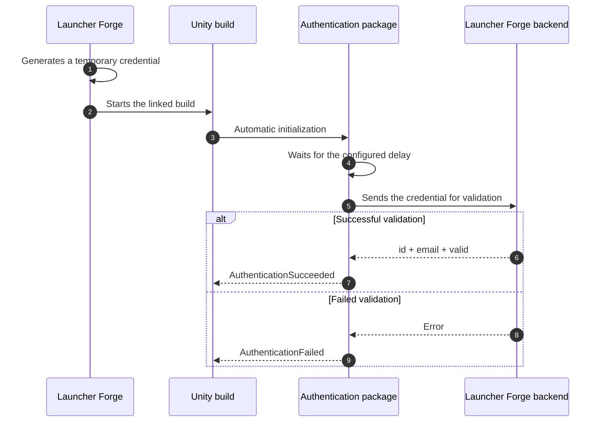
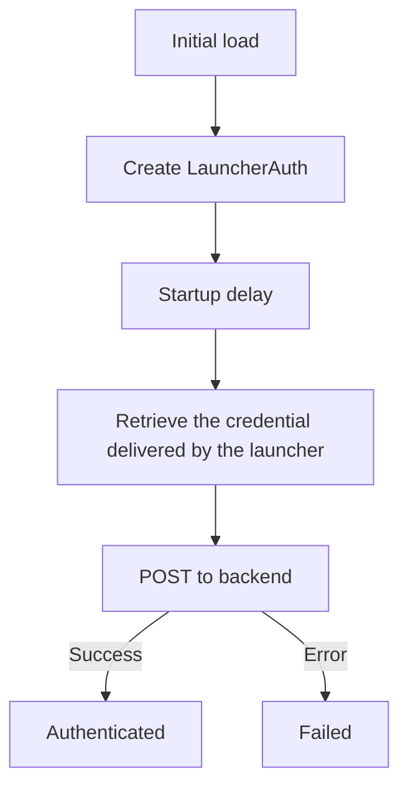

# Unity integration

**LauncherForge Launch Authentication** validates whether a Unity build was started from an authorized Launcher Forge session.

Your project can use the result to restrict game access or specific features until the backend confirms the connection between the launcher and the executable.

<Card
  title="Understand launch tokens"
  icon="shield-halved"
  href="/en/game-authentication/launch-tokens"
>
  Learn how Launcher Forge automatically generates and validates the temporary credential used during game startup.
</Card>

<Warning>
  Launcher Forge generates and delivers the temporary credential automatically. It must not be entered manually or used as a manual testing method.

  Pressing **Play** in the Unity Editor or running the build directly does not reproduce real authentication.
</Warning>

## How it works



<Info>
  The flow is automatic. You do not need to add the package to a `GameObject` or create a custom bootstrap.
</Info>

## Requirements

Before starting, confirm that:

- The game exists and is published in Launcher Forge.
- The game is linked to the launcher.
- Your Unity version is compatible with the package.
- The project can use local packages.
- You know the validation endpoint URL.
- The final test will use a published build started through Launcher Forge.

## Unity installation

<Card
  title="Download LauncherForge Launch Authentication 1.0.2"
  icon="download"
  href="https://discord.com/invite/2DwJtD9E3T"
>
  

  You can find the download link through our Discord server. Open the **DOWNLOAD PLUGIN** section and select the channel corresponding to your game engine.

  For this integration, open:

  ```text
  # unity
  ```
</Card>

<Note>
  The package is distributed as:

  ```text
  LauncherForge_LauncherAuth_Unity_1.0.2.zip
  ```
</Note>

### Install the package

You can install the package by copying it into the project or selecting its `package.json` through Unity Package Manager.

<Tabs>
  <Tab title="Copy into Packages">
    <Steps>
      <Step title="Extract the archive">
        Extract:

        ```text
        LauncherForge_LauncherAuth_Unity_1.0.2.zip
        ```
      </Step>

      <Step title="Rename the folder">
        The extracted folder is named:

        ```text
        com.launcherforge.launcherauth-1.0.2
        ```

        Rename it exactly to:

        ```text
        com.launcherforge.launcherauth
        ```
      </Step>

      <Step title="Copy the package into the project">
        Place the folder inside `Packages`:

        ```text
        YourUnityProject/
        ├── Assets/
        ├── Packages/
        │   └── com.launcherforge.launcherauth/
        ├── ProjectSettings/
        └── UserSettings/
        ```
      </Step>

      <Step title="Verify the structure">
        The package must contain:

        ```text
        Packages/
        └── com.launcherforge.launcherauth/
            ├── package.json
            ├── README.md
            ├── CHANGELOG.md
            └── Runtime/
                ├── LauncherAuthBootstrap.cs
                ├── LauncherAuthModels.cs
                ├── LauncherAuthSession.cs
                ├── LauncherAuthSettings.cs
                ├── LaunchTokenReader.cs
                └── LauncherForge.LauncherAuth.asmdef
        ```
      </Step>
    </Steps>

    <Frame caption="Package copied into the project's Packages folder">
      
    </Frame>
  </Tab>

  <Tab title="Package Manager">
    <Steps>
      <Step title="Open Package Manager">
        In Unity, open:

        ```text
        Window → Package Manager
        ```
      </Step>

      <Step title="Select Install package from disk">
        Select the `+` button and choose:

        ```text
        Install package from disk
        ```
      </Step>

      <Step title="Select package.json">
        Open:

        ```text
        com.launcherforge.launcherauth/package.json
        ```
      </Step>

      <Step title="Confirm installation">
        The package should appear as:

        ```text
        LauncherForge Launch Authentication 1.0.2
        ```
      </Step>
    </Steps>

    <Frame caption="LauncherForge Launch Authentication installed in Package Manager">
      
    </Frame>
  </Tab>
</Tabs>

---

## Create the configuration

The package automatically loads its configuration from `Resources`.

<Steps>
  <Step title="Create the Resources folder">
    Inside `Assets`, create:

    ```text
    Assets/Resources/
    ```
  </Step>

  <Step title="Create Launcher Auth Settings">
    Inside `Resources`, use:

    ```text
    Create → LauncherForge → Launcher Auth Settings
    ```
  </Step>

  <Step title="Use the exact name">
    The asset must be named:

    ```text
    LauncherAuthSettings
    ```
  </Step>

  <Step title="Verify the final path">
    The asset must be located at:

    ```text
    Assets/Resources/LauncherAuthSettings.asset
    ```
  </Step>
</Steps>

The name and location are required because the package loads the asset with:

```csharp
Resources.Load<LauncherAuthSettings>(
    "LauncherAuthSettings"
);
```

<Warning>
  If you rename the asset or move it outside `Assets/Resources`, the package cannot load the configuration automatically.
</Warning>

## Configure the backend

Select:

```text
Assets/Resources/LauncherAuthSettings.asset
```

The Inspector exposes:

<ResponseField name="Backend Url" type="string">
  Complete validation endpoint URL.
</ResponseField>

<ResponseField name="Startup Delay Seconds" type="float">
  Time the package waits before starting validation.
</ResponseField>

<ResponseField name="Timeout Seconds" type="float">
  Maximum time allowed for the HTTP request.
</ResponseField>

Recommended configuration:

```text
Backend Url:
https://backend.launcherforge.io/api/v1/games/auth/validate-launch-token

Startup Delay Seconds:
0.5

Timeout Seconds:
10
```

The internal request uses the contract expected by the backend:

```json
{
  "token": "TEMPORARY_CREDENTIAL"
}
```

<Note>
  The package builds this request automatically. You do not need to send it from another script or ask the player to enter a credential.
</Note>

---

## Automatic initialization

Do not add the package manually to a `GameObject`.

When the game loads, the package automatically creates:

```text
[LauncherAuth]
```

Internally, it uses:

```csharp
RuntimeInitializeOnLoadMethod
```

The object persists between scenes through:

```csharp
DontDestroyOnLoad
```

The internal flow is:



---

## Available states

Import the namespace:

```csharp
using LauncherForge.LauncherAuth;
```

The current state is available through:

```csharp
LauncherAuthSession.State
```

| State | Description |
| --- | --- |
| `LauncherAuthState.NotStarted` | Initialization has not started. |
| `LauncherAuthState.WaitingForStartup` | The package is waiting for the configured delay. |
| `LauncherAuthState.ReadingToken` | The package is retrieving the startup credential. |
| `LauncherAuthState.Validating` | The backend request is in progress. |
| `LauncherAuthState.Authenticated` | Authentication completed successfully. |
| `LauncherAuthState.Failed` | Authentication could not be completed. |

## Authenticated data

After successful validation, the user is available from:

```csharp
LauncherAuthSession.User
```

Available fields:

```csharp
LauncherAuthSession.User.id
LauncherAuthSession.User.email
LauncherAuthSession.User.valid
```

The identifier is a `string`:

```csharp
string userId = LauncherAuthSession.User.id;
```

<ResponseField name="id" type="string">
  Authenticated identifier returned by the backend.
</ResponseField>

<ResponseField name="email" type="string">
  Email associated with the validated session.
</ResponseField>

<ResponseField name="valid" type="boolean">
  Confirms that the credential was accepted.
</ResponseField>

---

## Read the current result

You can inspect the session from any script that imports the namespace.

```csharp
using LauncherForge.LauncherAuth;
using UnityEngine;

public sealed class LauncherAuthExample : MonoBehaviour
{
    private void Start()
    {
        if (LauncherAuthSession.IsAuthenticated)
        {
            LauncherAuthenticatedUser user =
                LauncherAuthSession.User;

            Debug.Log(
                $"Authenticated user: {user.id}"
            );

            Debug.Log(
                $"Email: {user.email}"
            );

            Debug.Log(
                $"Valid: {user.valid}"
            );
        }
    }
}
```

<Warning>
  Do not rely only on an `if` executed once in `Start`, because validation may still be in progress. Use the package events when you need to react immediately.
</Warning>

## Check a failed result

There is no property named:

```csharp
LauncherAuthSession.Failed
```

The correct check is:

```csharp
if (
    LauncherAuthSession.State ==
    LauncherAuthState.Failed
)
{
    string error =
        LauncherAuthSession.LastError;

    Debug.LogError(error);
}
```

Combined example:

```csharp
if (LauncherAuthSession.IsAuthenticated)
{
    LauncherAuthenticatedUser user =
        LauncherAuthSession.User;

    // The game decides how to continue.
}
else if (
    LauncherAuthSession.State ==
    LauncherAuthState.Failed
)
{
    string error =
        LauncherAuthSession.LastError;

    // The game decides how to display the error.
}
```

---

## Use authentication events

This is the recommended pattern for a main menu or any controller that must react as soon as validation finishes.

```csharp
using LauncherForge.LauncherAuth;
using UnityEngine;

public sealed class LauncherAuthMenuController : MonoBehaviour
{
    private void OnEnable()
    {
        LauncherAuthSession.AuthenticationSucceeded +=
            HandleAuthenticationSucceeded;

        LauncherAuthSession.AuthenticationFailed +=
            HandleAuthenticationFailed;

        EvaluateCurrentState();
    }

    private void OnDisable()
    {
        LauncherAuthSession.AuthenticationSucceeded -=
            HandleAuthenticationSucceeded;

        LauncherAuthSession.AuthenticationFailed -=
            HandleAuthenticationFailed;
    }

    private void EvaluateCurrentState()
    {
        if (LauncherAuthSession.IsAuthenticated)
        {
            HandleAuthenticationSucceeded(
                LauncherAuthSession.User
            );
            return;
        }

        if (
            LauncherAuthSession.State ==
            LauncherAuthState.Failed
        )
        {
            HandleAuthenticationFailed(
                LauncherAuthSession.LastError
            );
        }
    }

    private static void HandleAuthenticationSucceeded(
        LauncherAuthenticatedUser user)
    {
        Debug.Log(
            $"Authentication succeeded. " +
            $"User ID: {user.id}"
        );

        // The game decides what to do:
        // - enable Play
        // - load the menu
        // - enable online features
        // - load another scene
    }

    private static void HandleAuthenticationFailed(
        string error)
    {
        Debug.LogError(
            $"Authentication failed: {error}"
        );

        // The game decides what to do:
        // - display an error
        // - disable online options
        // - show a close button
        // - return to the launcher
    }
}
```

<Info>
  `EvaluateCurrentState()` is important because authentication may have finished before the object subscribed to the events.
</Info>

---

## Behavior inside the Unity Editor

When you press **Play** directly in the Editor, the expected result is an access-denied state.

This does not indicate a package error. It confirms that:

- Automatic initialization ran.
- The package attempted to retrieve the startup credential.
- The Editor did not receive a credential generated by Launcher Forge.
- `LauncherAuthSession.State` changed to `LauncherAuthState.Failed`.
- The error became available from `LauncherAuthSession.LastError`.

<Warning>
  The package does not provide a `TokenOverride` for the Editor. Real authentication cannot be tested with the Editor Play button.
</Warning>

<Frame caption="Expected result when the build was not started through Launcher Forge">
  
</Frame>

## Test real authentication

To verify the complete integration:

<Steps>
  <Step title="Create a Unity build">
    Build the project with all files required to run outside the Editor.
  </Step>

  <Step title="Publish the build">
    Upload the version through Launcher Forge CLI.
  </Step>

  <Step title="Link the game">
    Confirm that the published game is associated with the correct launcher.
  </Step>

  <Step title="Install the game from the launcher">
    Use a player account that has access to the game.
  </Step>

  <Step title="Start the build through Launcher Forge">
    The launcher generates and delivers the temporary credential automatically.
  </Step>

  <Step title="Verify the result">
    The session should become authenticated and `AuthenticationSucceeded` should run.
  </Step>
</Steps>

<Frame caption="Successful authentication in a build started through Launcher Forge">
  
</Frame>

When the backend responds successfully:

```json
{
  "success": true,
  "data": {
    "id": "12345",
    "email": "user@example.com",
    "valid": true
  }
}
```

The package sets:

```csharp
LauncherAuthSession.IsAuthenticated == true
```

```csharp
LauncherAuthSession.State ==
    LauncherAuthState.Authenticated
```

The user becomes available from:

```csharp
LauncherAuthSession.User
```

## Failed authentication result

Validation can fail because of:

- Missing credential.
- Invalid credential.
- Expired credential.
- Backend unavailable.
- Timeout.
- Invalid JSON response.
- `valid == false`.
- Missing or empty `id`.

The package sets:

```csharp
LauncherAuthSession.IsAuthenticated == false
```

```csharp
LauncherAuthSession.State ==
    LauncherAuthState.Failed
```

The message becomes available from:

```csharp
LauncherAuthSession.LastError
```

<Info>
  The package does not close the game automatically. Your project decides whether to display an error, disable features, offer a close action, return to the launcher, or continue with limited capabilities.
</Info>

---

## Troubleshooting

<AccordionGroup>
  <Accordion title="The package does not appear in Package Manager">
    Confirm that:

    - The folder is named `com.launcherforge.launcherauth`.
    - `package.json` is at the package root.
    - You selected the correct file through **Install package from disk**.
    - The Unity version is compatible.
  </Accordion>

  <Accordion title="LauncherAuthSettings is not loaded">
    Confirm the exact path and name:

    ```text
    Assets/Resources/LauncherAuthSettings.asset
    ```

    The asset must be named exactly `LauncherAuthSettings`.
  </Accordion>

  <Accordion title="The session remains Failed in the Editor">
    This is the expected result. The Editor does not receive a temporary Launcher Forge credential, and the package does not provide an override to simulate one.

    Perform the final test with a published, linked build started through the launcher.
  </Accordion>

  <Accordion title="The backend does not respond">
    Review:

    - `Backend Url`.
    - Backend availability.
    - HTTPS certificate.
    - `Timeout Seconds`.
    - Build connectivity.
  </Accordion>

  <Accordion title="Authentication finishes before the menu listens to events">
    Call `EvaluateCurrentState()` after subscribing. This processes a result that may have completed before `OnEnable`.
  </Accordion>

  <Accordion title="The build opens but does not authenticate">
    Confirm that:

    - The build was published through the CLI.
    - The game is linked to the correct launcher.
    - The correct main executable is configured.
    - The build was started through Launcher Forge.
    - The settings asset is included under `Resources`.
  </Accordion>
</AccordionGroup>

---

## License and sample project

<Warning>
  According to the integration document, the package is provided free of charge and may not be commercialized or resold.
</Warning>

<Card
  title="Download UnityThirdPersonAuthTest"
  icon="flask"
  href="https://discord.com/invite/2DwJtD9E3T"
>
  

  You can find the download link through our Discord server. Open the **DOWNLOAD TEMPLATES** section and select the channel corresponding to your game engine.

  For the Unity sample project, open:

  ```text
  # thid-person-auth-test-unity
  ```
</Card>

<Note>
  `UnityThirdPersonAuthTest` includes the package and a prepared integration for Unity 6 or another compatible version.
</Note>

## Verification checklist

- The package is located at `Packages/com.launcherforge.launcherauth`.
- Package Manager shows LauncherForge Launch Authentication.
- `Assets/Resources/LauncherAuthSettings.asset` exists.
- `Backend Url` contains the complete endpoint.
- `Startup Delay Seconds` is set to `0.5`.
- `Timeout Seconds` is set to `10`.
- You did not add a manual bootstrap to a GameObject.
- Your code imports `LauncherForge.LauncherAuth`.
- The menu uses events or evaluates the current state.
- The project handles both `Authenticated` and `Failed`.
- You do not attempt to enter a credential manually.
- The final test uses a linked build started through Launcher Forge.

<Check>
  The integration is ready when a build started through Launcher Forge invokes `AuthenticationSucceeded`, exposes `id`, `email`, and `valid`, and your game correctly handles the `Failed` state.
</Check>

## Related guides

<CardGroup cols={3}>
  <Card
    title="Launch tokens"
    icon="shield-halved"
    href="/en/game-authentication/launch-tokens"
  >
    Understand the automatic validation flow between the launcher and the game.
  </Card>

  <Card
    title="Publish your first build"
    icon="cloud-arrow-up"
    href="/en/getting-started/publish-first-build"
  >
    Publish the Unity build through the interactive CLI.
  </Card>

  <Card
    title="Test your launcher"
    icon="flask"
    href="/en/getting-started/test-launcher"
  >
    Verify installation, download, and startup through Launcher Forge.
  </Card>
</CardGroup>
