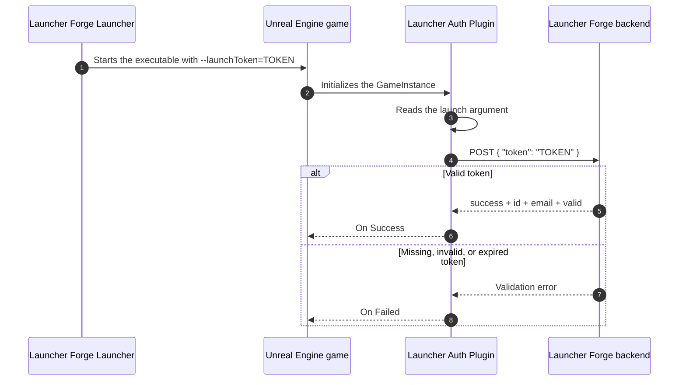
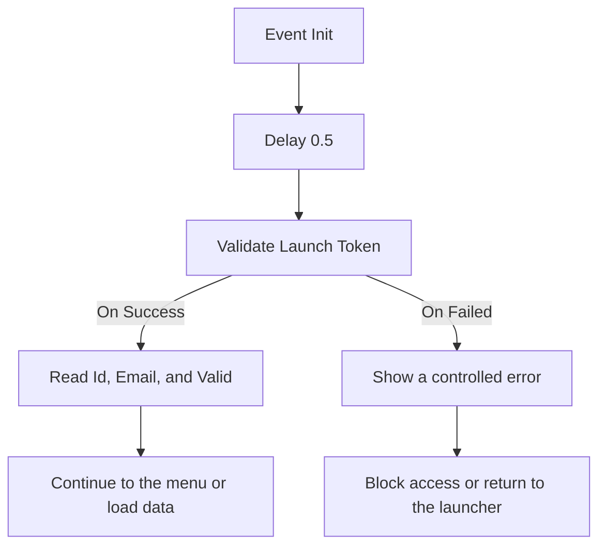

# Unreal Engine integration

**Launcher Auth Plugin** allows a game built with Unreal Engine to validate whether it was started from an authorized Launcher Forge session.

When the player starts the game from the launcher:

1. Launcher Forge generates a temporary launch token.
2. The launcher passes the token to the executable through `--launchToken`.
3. The plugin reads the argument during startup.
4. The game sends the token to the backend validation endpoint.
5. The backend returns the validated session data.
6. Blueprint or C++ continues according to the result.

<Card
  title="Understand launch tokens"
  icon="shield-halved"
  href="/en/game-authentication/launch-tokens"
>
  Review the complete token generation, delivery, and validation flow between the launcher and the game.
</Card>

<Warning>
  This guide documents the technical connection between the **launcher** and the **game**.

  It does not replace end-user registration, launcher sign-in, game ownership, or CD key redemption.
</Warning>

## Validation architecture



## Available validated data

After a successful validation, the plugin exposes only the session data required by the current integration:

| Field | Type | Description |
| --- | --- | --- |
| `Id` | `string` | Authenticated identifier returned by the backend. |
| `Email` | `string` | Email associated with the validated session. |
| `Valid` | `boolean` | Confirms that the launch token was accepted. |

The plugin no longer exposes these as separate fields:

- `username`
- `userId`
- `gameId`
- `launcherId`

---

## Before you begin

Confirm the following:

- The game exists and is published in Launcher Forge.
- The game is linked to the launcher.
- The launch-token validation endpoint is available.
- You have the complete backend validation URL.
- The plugin package matches the Unreal Engine version used by the project.
- The project can compile C++ plugins when required.

Example endpoint:

```text
http://backend.launcherforge.io/api/v1/games/auth/validate-launch-token
```

---

## Install Launcher Auth Plugin

<Tabs>
  <Tab title="Install from Fab">
    After adding the plugin to your Fab library, install it for the Unreal Engine version used by your project.

    <Steps>
      <Step title="Open Epic Games Launcher">
        Sign in with the Epic Games account that owns the plugin.
      </Step>

      <Step title="Open your Fab library">
        Go to the Fab library and locate **Forge Launcher Auth**.
      </Step>

      <Step title="Install the plugin">
        Select the same Unreal Engine version used by your project.
      </Step>

      <Step title="Open the project">
        Start your Unreal Engine project.
      </Step>

      <Step title="Enable the plugin">
        Go to **Edit → Plugins**, search for **Launcher Auth Plugin**, and enable it.
      </Step>

      <Step title="Restart Unreal Engine">
        Restart the editor when Unreal Engine requests it.
      </Step>
    </Steps>

    {/* PHOTO AREA: Fab Library showing Forge Launcher Auth. */}
    <Frame caption="Forge Launcher Auth in the Fab library">
      
    </Frame>

    {/* PHOTO AREA: Epic Games Launcher showing the installed engine version. */}
    <Frame caption="Plugin installed for a specific Unreal Engine version">
      
    </Frame>

    {/* PHOTO AREA: Unreal Engine Plugin Browser with plugin enabled. */}
    <Frame caption="Launcher Auth Plugin enabled in Unreal Engine">
      
    </Frame>
  </Tab>

  <Tab title="Manual installation">
    You can also install the plugin directly inside the project.

    <Note>
      Use the package compiled for the exact Unreal Engine version used by your project.
    </Note>

    {/* TODO: Add the official download links for UE 5.5, 5.6, 5.7, and 5.8. */}

    <Steps>
      <Step title="Download the correct package">
        Download the `LauncherAuthPlugin.zip` package that matches your Unreal Engine version.
      </Step>

      <Step title="Open the project directory">
        Open the folder that contains `YourProject.uproject`.
      </Step>

      <Step title="Create the Plugins folder">
        If it does not exist, create a folder named:

        ```text
        Plugins
        ```
      </Step>

      <Step title="Extract the plugin">
        Extract the package inside the `Plugins` folder.

        The resulting structure should look similar to:

        ```text
        YourProject/
        ├── YourProject.uproject
        └── Plugins/
            └── LauncherAuthPlugin/
                ├── LauncherAuthPlugin.uplugin
                ├── Binaries/
                ├── Resources/
                └── Source/
        ```
      </Step>

      <Step title="Regenerate project files">
        Right-click `YourProject.uproject` and select:

        ```text
        Generate Visual Studio project files
        ```
      </Step>

      <Step title="Rebuild the project">
        Open `YourProject.sln` and compile the project again.
      </Step>

      <Step title="Confirm activation">
        Open Unreal Engine, go to **Edit → Plugins**, and confirm that **Launcher Auth Plugin** is enabled.
      </Step>
    </Steps>

    {/* PHOTO AREA: Project directory showing the Plugins folder. */}
    <Frame caption="Plugin installed inside the project's Plugins folder">
      
    </Frame>

    {/* PHOTO AREA: Unreal Engine Plugin Browser with plugin enabled. */}
    <Frame caption="Launcher Auth Plugin ready to use">
      
    </Frame>
  </Tab>
</Tabs>

## Engine-version compatibility

Launcher Auth Plugin is a C++ plugin.

Precompiled binaries depend on the Unreal Engine version for which they were built.

<Warning>
  A package compiled for one engine version is not guaranteed to work with later versions automatically.
</Warning>

Always use the package that matches the exact engine version used by the project.

According to the current integration document, Unreal Engine **5.6 and later** must be validated before being marked as officially supported.

---

## Configure a custom GameInstance

The recommended place to start validation is a custom Blueprint based on `GameInstance`.

This allows the game to validate the launcher connection before loading:

- Player-specific data.
- Online menus.
- Save files.
- Protected services.
- Systems that depend on an authorized session.

## 1. Create the GameInstance

<Steps>
  <Step title="Create a Blueprint class">
    Create a Blueprint based on `GameInstance`.
  </Step>

  <Step title="Name the class">
    For example:

    ```text
    BP_GameInstance
    ```
  </Step>

  <Step title="Open Project Settings">
    Go to **Edit → Project Settings**.
  </Step>

  <Step title="Open Maps & Modes">
    Locate the **Maps & Modes** section.
  </Step>

  <Step title="Assign Game Instance Class">
    In **Game Instance Class**, select `BP_GameInstance`.
  </Step>
</Steps>

{/* PHOTO AREA: Project Settings > Maps & Modes > Game Instance Class. */}
<Frame caption="Game Instance Class configured in Project Settings">
  
</Frame>

## 2. Configure Event Init

Open `BP_GameInstance` and create this flow:

```text
Event Init
    ↓
Delay 0.5
    ↓
Validate Launch Token
```

<Warning>
  Add a **0.5-second Delay** before calling `Validate Launch Token`.

  In packaged builds, some startup systems may not be fully initialized at the exact moment `Event Init` runs.
</Warning>

Without this delay, the plugin may:

- Fail to find `--launchToken`.
- Fail to access its subsystem.
- Return an authentication error even when the launcher passed the token correctly.

{/* PHOTO AREA: Blueprint Event Init -> Delay 0.5 -> Validate Launch Token. */}
<Frame caption="Recommended BP_GameInstance validation flow">
  
</Frame>

---

## Configure Validate Launch Token

The plugin's main Blueprint node is:

```text
Validate Launch Token
```

### Input

| Input | Description |
| --- | --- |
| **Backend Url** | Complete URL of the endpoint that validates the launch token. |

Example:

```text
http://backend.launcherforge.io/api/v1/games/auth/validate-launch-token
```

### Output delegates

| Delegate | When it runs |
| --- | --- |
| **On Success** | The backend accepted the token and returned valid data. |
| **On Failed** | The token is missing, expired, invalid, or the HTTP request failed. |

## Recommended Blueprint flow



### On Success

You can:

- Store the validated data for the current session.
- Continue to the main menu.
- Load user-specific information.
- Enable protected systems.
- Allow access to the game.

### On Failed

You can:

- Display an authentication error.
- Block access.
- Ask the player to start the game from Launcher Forge.
- Return to a safe screen.
- Close the game in a controlled way.

{/* PHOTO AREA: Complete Blueprint with success and failed branches. */}
<Frame caption="Complete Blueprint flow with On Success and On Failed">
  
</Frame>

---

## Launch-token contract

Launcher Forge generates the token when the player starts the game.

Do not:

- Store it in the project.
- Hardcode it in Blueprint.
- Hardcode it in C++.
- Save it in configuration files.
- Display it in the UI.
- Print the complete token in production logs.

The launcher starts the game using:

```text
--launchToken=TOKEN
```

No additional launch arguments are required for this integration.

{/* PHOTO AREA: Game executable launched with --launchToken. */}
<Frame caption="Executable started with the launchToken argument">
  
</Frame>

## Request sent by the plugin

The plugin sends an HTTP request with this body:

```json
{
  "token": "TOKEN"
}
```

<Note>
  The presence of the argument does not mean the connection has already been validated. The game must wait for the backend response.
</Note>

{/* PHOTO AREA: Backend request inspector showing token body. */}
<Frame caption="Request body sent to the validation endpoint">
  
</Frame>

## Expected response

The backend must return this structure:

```json
{
  "success": true,
  "data": {
    "id": "authenticated-id",
    "email": "player@example.com",
    "valid": true
  }
}
```

<ResponseField name="success" type="boolean">
  Indicates that the request was processed successfully.
</ResponseField>

<ResponseField name="data.id" type="string">
  Authenticated identifier returned by the backend.
</ResponseField>

<ResponseField name="data.email" type="string">
  Email associated with the validated session.
</ResponseField>

<ResponseField name="data.valid" type="boolean">
  Confirms that the backend accepted the launch token.
</ResponseField>

{/* PHOTO AREA: Break Struct or validated data in Blueprint. */}
<Frame caption="Data available after successful validation">
  
</Frame>

---

## Blueprint usage

The recommended flow is:

```text
Event Init
    ↓
Delay 0.5
    ↓
Validate Launch Token
    ├── On Success
    └── On Failed
```

<Tabs>
  <Tab title="On Success">
    1. Confirm that `Valid` is `true`.
    2. Store `Id` and `Email` when needed during the session.
    3. Load systems that depend on authentication.
    4. Open the main menu or continue startup.
  </Tab>

  <Tab title="On Failed">
    1. Show a short error message.
    2. Block protected systems.
    3. Tell the player to start the game from Launcher Forge.
    4. Return to a safe screen or close the game.
  </Tab>
</Tabs>

Example player-facing message:

```text
The game launch could not be validated through Launcher Forge.
```

Do not display:

- The token.
- The full internal URL.
- HTTP headers.
- Stack traces.
- Sensitive backend details.

{/* PHOTO AREA: Print String or UI widget showing authenticated identity. */}
<Frame caption="Validated identity used from Blueprint">
  
</Frame>

---

## C++ usage

The plugin is primarily designed for Blueprint, but C++ projects can also access authentication data through the plugin classes.

Typical use cases include:

- Checking whether the session was validated.
- Reading the authenticated data.
- Reacting to success or failure.
- Integrating validation with project-specific systems.

## Recommended pattern

1. Wait approximately `0.5` seconds after initialization.
2. Access the plugin subsystem from the current `GameInstance`.
3. Start or wait for validation.
4. Read the data only after a successful result.
5. Do not continue when validation fails.

<Warning>
  The same initialization rule applies in C++: avoid validating at the very first instant of `Init`.
</Warning>

Conceptual example:

```cpp
UGameInstance* GameInstance = GetGameInstance();
if (!GameInstance)
{
    return;
}

// Access the Launcher Auth subsystem from the GameInstance.
// Read authentication data only after validation succeeds.
```

The source document does not define a complete public C++ API or final method names for this example. Use the classes exposed by the installed plugin version.

{/* PHOTO AREA: IDE showing access to the plugin subsystem. */}
<Frame caption="Accessing the plugin subsystem from a C++ project">
  
</Frame>

---

## Test the integration

The primary test should use a packaged build started from Launcher Forge.

<Steps>
  <Step title="Package the game">
    Create a **Development** build first to simplify diagnostics.
  </Step>

  <Step title="Publish the build">
    Upload the version through Launcher Forge CLI.
  </Step>

  <Step title="Open the launcher">
    Sign in with a valid launcher player account.
  </Step>

  <Step title="Install the game">
    Download the build from the launcher.
  </Step>

  <Step title="Start the game">
    Select **Play** and allow Launcher Forge to generate and pass the token.
  </Step>

  <Step title="Confirm the result">
    Verify that `On Success` runs and `Valid` is `true`.
  </Step>
</Steps>

<Info>
  Testing only in the editor may not reproduce the startup order of a packaged build.
</Info>

### Manual argument test

For a controlled technical test, the executable can be started with:

<CodeGroup>
```powershell PowerShell
.\YourGame.exe "--launchToken=TOKEN"
```

```text Command Prompt
YourGame.exe --launchToken=TOKEN
```
</CodeGroup>

<Warning>
  Use only a valid temporary token generated for the test. Do not store it in the project or reuse it as permanent configuration.
</Warning>

---

## Common errors

<AccordionGroup>
  <Accordion title="Validation fails immediately during startup">
    **Likely cause:** `Validate Launch Token` is called too early from `GameInstance Init`.

    **Resolution:**

    ```text
    Event Init → Delay 0.5 → Validate Launch Token
    ```

    Also confirm that `BP_GameInstance` is assigned under **Project Settings → Maps & Modes**.
  </Accordion>

  <Accordion title="The game cannot find the launch token">
    **Likely cause:** the executable was not started with `--launchToken`.

    **Resolution:**

    - Start the game from Launcher Forge.
    - Confirm that the launcher uses the correct build and executable.
    - For a manual test:

    ```powershell
    .\YourGame.exe "--launchToken=TOKEN"
    ```
  </Accordion>

  <Accordion title="It works in the editor but fails in a packaged build">
    **Likely cause:** the initialization order differs in a packaged build.

    **Resolution:**

    - Use the recommended `0.5`-second delay.
    - Test a **Development** build first.
    - Confirm that the custom GameInstance is configured.
    - Confirm that the plugin is included in the packaged build.
  </Accordion>

  <Accordion title="The backend returns HTTP 401">
    **Likely causes:**

    - The token is invalid.
    - The token expired.
    - The token was signed with another secret.
    - The validation endpoint rejected the token.

    **Resolution:**

    - Start the game from Launcher Forge again to generate a new token.
    - Confirm that the backend receives:

    ```json
    {
      "token": "TOKEN"
    }
    ```

    - Confirm that the token has not expired.
    - Confirm that the backend uses the correct launch-token validation configuration.
  </Accordion>

  <Accordion title="The backend returns HTTP 404">
    **Likely cause:** the **Backend Url** value is incorrect.

    **Resolution:**

    Review the URL configured in `Validate Launch Token`.

    ```text
    http://backend.launcherforge.io/api/v1/games/auth/validate-launch-token
    ```
  </Accordion>

  <Accordion title="Validate Launch Token does not appear in Blueprint">
    **Likely causes:**

    - The plugin is disabled.
    - Unreal Engine must be restarted.
    - The C++ project was not rebuilt.
    - The package targets another engine version.

    **Resolution:**

    1. Open **Edit → Plugins**.
    2. Search for **Launcher Auth Plugin**.
    3. Enable it.
    4. Restart Unreal Engine.
    5. Regenerate Visual Studio files when required.
    6. Rebuild the project.
  </Accordion>

  <Accordion title="The subsystem is unavailable">
    **Likely cause:** validation or plugin access occurs before the `GameInstance` and its subsystems are ready.

    **Resolution:**

    - Keep the validation flow inside the GameInstance.
    - Add the recommended delay.
    - Avoid starting validation from an object created before the GameInstance.
  </Accordion>
</AccordionGroup>

---

## Verification checklist

Before publishing the integration, confirm:

- Launcher Auth Plugin is installed for the correct Unreal Engine version.
- The plugin is enabled.
- The project was rebuilt when required.
- `BP_GameInstance` is assigned in Maps & Modes.
- The flow starts from `Event Init`.
- A `0.5`-second Delay is present.
- `Validate Launch Token` uses the correct backend URL.
- `On Success` continues only when `Valid` is `true`.
- `On Failed` blocks access in a controlled way.
- The token is not hardcoded.
- The request body is `{ "token": "TOKEN" }`.
- The response contains `success`, `data.id`, `data.email`, and `data.valid`.
- The final test was performed with a packaged build started from Launcher Forge.

<Check>
  The integration is ready when the game receives the token from the launcher, validates it with the backend, and correctly distinguishes `On Success` from `On Failed`.
</Check>

## Related guides

<CardGroup cols={3}>
  <Card
    title="Launch tokens"
    icon="shield-halved"
    href="/en/game-authentication/launch-tokens"
  >
    Understand the complete validation contract between the launcher and the game.
  </Card>

  <Card
    title="Publish your first build"
    icon="cloud-arrow-up"
    href="/en/getting-started/publish-first-build"
  >
    Publish a packaged build through the interactive CLI.
  </Card>

  <Card
    title="Test your launcher"
    icon="flask"
    href="/en/getting-started/test-launcher"
  >
    Verify game download, installation, and startup through Launcher Forge.
  </Card>
</CardGroup>
