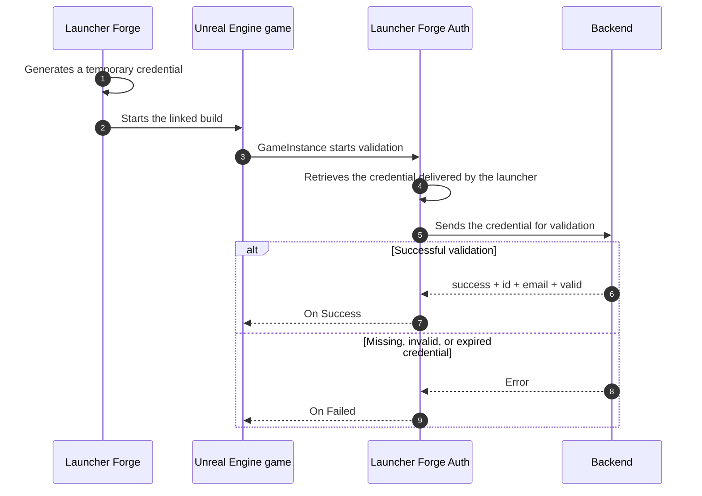

# Unreal Engine integration

**Launcher Forge Auth** allows an Unreal Engine game to validate whether it was started from an authorized Launcher Forge session.

When a player starts the game from the launcher:

1. Launcher Forge generates a temporary credential for that launch.
2. The launcher starts the compiled executable and delivers the credential automatically.
3. The plugin internally retrieves the credential supplied by the launcher.
4. The plugin sends it to the validation endpoint.
5. The backend returns `id`, `email`, and `valid`.
6. The game continues or blocks access according to the result.

<Note>
  The temporary credential is not generated or entered manually. A real validation can only be tested after the compiled build is linked and started through Launcher Forge.
</Note>

<Card
  title="Understand launch tokens"
  icon="shield-halved"
  href="/en/player-authentication/launch-tokens"
>
  Review the complete generation, delivery, and validation flow between the launcher and the game.
</Card>

## Validation flow



## Direct plugin packages

<Card
  title="Download Launcher Forge Auth for Unreal Engine"
  icon="download"
  href="https://discord.com/invite/2DwJtD9E3T"
>
  

  You can find the download link through our Discord server. Open the **DOWNLOAD PLUGIN** section and select the channel corresponding to your game engine.

  For Unreal Engine, open:

  ```text
  # unreal-engine
  ```
</Card>

<Note>
  Always use the package that matches the exact Unreal Engine version used by your project.
</Note>

### Other installation methods and resources

<CardGroup cols={2}>
  <Card title="Installation through Fab" icon="store">
    <Badge color="gray">Not available yet</Badge>

    Distribution through Fab is not currently enabled. Use the package available through Discord and follow the manual installation process.
  </Card>

  <Card title="UE 5.5 sample project" icon="folder-open">
    <Badge color="gray">Download not available yet</Badge>

    The documentation describes `GameLauncherClient`, but a public download URL is not available yet.
  </Card>
</CardGroup>

---

## Manual installation

Manual installation places the plugin directly inside the project.

<Steps>
  <Step title="Extract the package">
    Extract the `LauncherAuthPlugin.zip` package for your Unreal Engine version.
  </Step>

  <Step title="Open the project directory">
    Open the folder containing `YourProject.uproject`.
  </Step>

  <Step title="Create the Plugins directory">
    When it does not exist, create:

    ```text
    YourProject/
    └── Plugins/
    ```
  </Step>

  <Step title="Copy the plugin">
    Extract the plugin into `Plugins`.

    Expected structure:

    ```text
    YourProject/
    ├── YourProject.uproject
    └── Plugins/
        └── LauncherForgeAuth/
            ├── Binaries/
            ├── Content/
            ├── Intermediate/
            ├── Resources/
            ├── Source/
            └── LauncherForgeAuth.uplugin
    ```
  </Step>

  <Step title="Regenerate project files">
    Right-click `YourProject.uproject` and select:

    ```text
    Generate Visual Studio project files
    ```
  </Step>

  <Step title="Compile the project">
    Open `YourProject.sln` and compile the project again.
  </Step>

  <Step title="Verify the plugin">
    Open Unreal Engine and go to **Edit → Plugins**. Confirm that **Launcher Forge Auth** is enabled.
  </Step>
</Steps>

<Frame caption="Plugin structure inside the project Plugins directory">
  
</Frame>

<Frame caption="Launcher Forge Auth enabled in Unreal Engine">
  
</Frame>

<Warning>
  C++ plugin binaries depend on the engine version. A package compiled for another version may require recompilation.
</Warning>

---

## GameInstance configuration

The recommended place to start validation is a custom Blueprint based on `GameInstance`.

This validates the connection before loading:

- Player data.
- Online menus.
- Save games.
- Protected features.
- Systems that require a valid launcher connection.

## 1. Create and assign the GameInstance

<Steps>
  <Step title="Create the Blueprint">
    Create a Blueprint class based on `GameInstance`.
  </Step>

  <Step title="Name the class">
    For example:

    ```text
    BP_GameInstance
    ```
  </Step>

  <Step title="Open Project Settings">
    Go to **Edit → Project Settings → Maps & Modes**.
  </Step>

  <Step title="Select the class">
    Under **Game Instance Class**, select `BP_GameInstance`.
  </Step>
</Steps>

<Frame caption="BP_GameInstance assigned in Maps & Modes">
  
</Frame>

## 2. Configure Event Init

Inside the `BP_GameInstance` Event Graph, use:

```text
Event Init → Delay 0.5 → Validate Launch Token
```

<Warning>
  Add a **0.5-second** delay before calling `Validate Launch Token`.

  In a packaged build, the subsystem or command-line arguments may not be ready during the first frame of `Init`.
</Warning>

<Frame caption="Event Init, Delay 0.5, and Validate Launch Token">
  
</Frame>

---

## Validate Launch Token node

The main plugin node is:

```text
Validate Launch Token
```

### Input

| Input | Description |
| --- | --- |
| **Backend Url** | Complete URL of the endpoint that validates the launch token. |

Endpoint used by the source document:

```text
https://backend.launcherforge.io/api/v1/games/auth/validate-launch-token
```

### Output delegates

| Delegate | Behavior |
| --- | --- |
| **On Success** | Runs when the backend validates the token successfully. |
| **On Failed** | Runs when the token is missing, expired, invalid, or the HTTP request fails. |

<Frame caption="Main node and authenticated data">
  
</Frame>

### On Success

Use `On Success` to:

- Confirm that `Valid` is `true`.
- Store or use `Id` and `Email`.
- Continue to the main menu.
- Load account-specific data.
- Enable protected systems.
- Allow access to the game.

### On Failed

Use `On Failed` to:

- Display a controlled error.
- Block access.
- Ask the player to start the game from Launcher Forge.
- Return to an initial screen.
- Close the game gracefully.

<Frame caption="Complete Blueprint flow with success and failure branches">
  
</Frame>

---

## Automatic validation

Launcher Forge generates and delivers the temporary credential as part of the normal game launch.

The developer must not:

- Create credentials manually for testing.
- Store them in the project.
- Hardcode them in Blueprint or C++.
- Store them in configuration files.
- Display them in the user interface.
- Print complete values in production logs.

<Info>
  The plugin receives the credential automatically when a linked build is started through Launcher Forge. Opening the game in the editor or running the `.exe` directly does not reproduce a real validation.
</Info>

### Internal plugin request

The plugin internally sends the credential to the backend using the contract expected by the validation endpoint:

```json
{
  "token": "TEMPORARY_CREDENTIAL"
}
```

Do not build this request from Blueprint or ask the player to enter a token.

## Expected response

```json
{
  "success": true,
  "data": {
    "id": "authenticated-id",
    "email": "player@example.com",
    "valid": true
  }
}
```

<ResponseField name="success" type="boolean">
  Indicates that the backend processed validation successfully.
</ResponseField>

<ResponseField name="data.id" type="string">
  Authenticated account or session identifier.
</ResponseField>

<ResponseField name="data.email" type="string">
  Email address associated with the authenticated session.
</ResponseField>

<ResponseField name="data.valid" type="boolean">
  Confirms that the backend accepted the launch token.
</ResponseField>

The plugin currently exposes:

```text
Id
Email
Valid
```


---

## Initial test inside the editor

Before packaging and linking the game to a launcher, you can confirm that the integration initialized by reviewing the Output Log.

In this scenario, it is correct to see:

- An empty token.
- `Length: 0`.
- A warning that the connection initialized but requires a valid token.

<Frame caption="Invalid result before starting through the launcher">
  
</Frame>

<Frame caption="Output Log with an empty token in the editor">
  
</Frame>

Expected log example:

```text
[LauncherForgeAuth] Launch token found. Length: 0
[LauncherForgeAuth] Request method: POST
[LauncherForgeAuth] HTTP request started.
[LauncherForgeAuth] Connection was initialized, but it requires a valid token.
```

<Info>
  This confirms that the plugin and connection initialized. It does not confirm valid authentication because the editor did not receive a launcher-generated token.
</Info>

---

## Test with a linked build

Complete validation must be tested with:

1. A packaged game.
2. A published build.
3. The game linked to the launcher.
4. The executable started from Launcher Forge.
5. A launch token generated during that startup.

When validation succeeds:

- `Valid` is `true`.
- `Email` contains the authenticated email.
- `Id` contains the returned identifier.
- `On Success` runs.

<Frame caption="Authenticated game after launching through Launcher Forge">
  
</Frame>

<Check>
  The connection is valid when the game reads the launcher-generated token, the backend accepts it, and the plugin returns through `On Success`.
</Check>

---

## C++ usage

C++ projects can use the public plugin classes.

### Main classes

| Class | Responsibility |
| --- | --- |
| `UValidateLaunchTokenAsync` | Validates the token against the backend. This class powers the Blueprint node. |
| `ULauncherForgeAuthSubsystem` | Retrieves the temporary credential delivered by Launcher Forge and stores the authenticated user after successful validation. |
| `FLauncherForgeAuthUser` | Contains `Id`, `Email`, and `Valid`. |

## Recommended C++ flow

```text
GameInstance::Init()
→ Delay 0.5 seconds
→ Validate Launch Token
→ On Success: read FLauncherForgeAuthUser
→ On Failed: handle the authentication error
```

<Warning>
  Keep the `0.5`-second delay in C++ as well. This avoids early initialization problems in packaged builds.
</Warning>

### `.cpp` example

```cpp
#include "MyGameInstance.h"
#include "TimerManager.h"
#include "ValidateLaunchTokenAsync.h"
#include "LauncherForgeAuthTypes.h"

void UMyGameInstance::Init()
{
    Super::Init();

    GetWorld()->GetTimerManager().SetTimer(
        LauncherAuthTimerHandle,
        this,
        &UMyGameInstance::ValidateLauncherSession,
        0.5f,
        false
    );
}

void UMyGameInstance::ValidateLauncherSession()
{
    const FString BackendUrl =
        TEXT("https://your-api.com/api/v1/games/auth/validate-launch-token");

    UValidateLaunchTokenAsync* AuthNode =
        UValidateLaunchTokenAsync::ValidateLaunchToken(
            this,
            BackendUrl
        );

    if (!AuthNode)
    {
        UE_LOG(
            LogTemp,
            Error,
            TEXT("[LauncherForgeAuth] Failed to create validation node.")
        );
        return;
    }

    AuthNode->OnSuccess.AddDynamic(
        this,
        &UMyGameInstance::HandleLauncherAuthSuccess
    );

    AuthNode->OnFailed.AddDynamic(
        this,
        &UMyGameInstance::HandleLauncherAuthFailed
    );

    AuthNode->Activate();
}

void UMyGameInstance::HandleLauncherAuthSuccess(
    FLauncherForgeAuthUser User
)
{
    UE_LOG(
        LogTemp,
        Log,
        TEXT("[LauncherForgeAuth] Authenticated user: %s"),
        *User.Email
    );
}

void UMyGameInstance::HandleLauncherAuthFailed(
    FString ErrorMessage
)
{
    UE_LOG(
        LogTemp,
        Error,
        TEXT("[LauncherForgeAuth] Authentication failed: %s"),
        *ErrorMessage
    );
}
```

### `.h` excerpt

```cpp
#include "LauncherForgeAuthTypes.h"

FTimerHandle LauncherAuthTimerHandle;

UFUNCTION()
void ValidateLauncherSession();

UFUNCTION()
void HandleLauncherAuthSuccess(
    FLauncherForgeAuthUser User
);

UFUNCTION()
void HandleLauncherAuthFailed(
    FString ErrorMessage
);
```

<Note>
  The code above reproduces the source document's example. Integrate it into the real declaration of your `UGameInstance` class and the appropriate source files.
</Note>

---

## GameLauncherClient sample project

The free `GameLauncherClient` sample project targets **Unreal Engine 5.5** and includes:

- The plugin.
- A configured GameInstance.
- The validation flow.
- A starting point for testing.

<Card
  title="Download GameLauncherClient for UE 5.5"
  icon="folder-open"
  href="https://discord.com/invite/2DwJtD9E3T"
>
  

  You can find the download link through our Discord server. Open the **DOWNLOAD TEMPLATES** section and select the channel corresponding to your game engine.

  For the Unreal Engine sample project, open:

  ```text
  # game-launcher-cliente-ue
  ```
</Card>

<Note>
  The project targets Unreal Engine 5.5. Later versions may require recompilation.

  The plugin is free and must not be commercialized or resold separately.
</Note>

---

## Troubleshooting

<AccordionGroup>
  <Accordion title="The node does not appear">
    Confirm that the plugin exists under `Plugins`, is enabled under **Edit → Plugins**, and was compiled for the correct engine version.
  </Accordion>

  <Accordion title="The subsystem is unavailable">
    Start validation from GameInstance and keep the `0.5`-second delay.
  </Accordion>

  <Accordion title="Length is 0 inside the editor">
    This is expected before the game is started through Launcher Forge. Confirm that the initialized-connection warning is also present.
  </Accordion>

  <Accordion title="On Failed runs in the packaged build">
    Confirm that the build is linked, the launcher uses the correct executable, and `Backend Url` points to the validation endpoint.
  </Accordion>

  <Accordion title="The backend rejects validation">
    Close the game and start it again through Launcher Forge to create a new temporary session.

    Also confirm that:

    - The build is linked to the launcher.
    - The launcher uses the correct executable.
    - `Backend Url` points to the validation endpoint.
    - The test is not being performed from the editor or by running the `.exe` directly.
  </Accordion>

  <Accordion title="The plugin was compiled for another engine version">
    Use a package for the current engine version or recompile the plugin with the project.
  </Accordion>
</AccordionGroup>

## Verification checklist

- The plugin is installed under `Plugins`.
- Launcher Forge Auth is enabled.
- The project was recompiled.
- `BP_GameInstance` is assigned under Maps & Modes.
- `Event Init` uses a `0.5`-second delay.
- `Validate Launch Token` uses the correct URL.
- `On Success` continues only when `Valid` is `true`.
- `On Failed` blocks access in a controlled way.
- No credential is manually created, entered, or reused.
- The plugin performs the validation request internally.
- The final test was completed from a linked build started through Launcher Forge.

## Related guides

<CardGroup cols={3}>
  <Card
    title="Launch tokens"
    icon="shield-halved"
    href="/en/game-authentication/launch-tokens"
  >
    Understand the complete validation contract.
  </Card>

  <Card
    title="Publish your first build"
    icon="cloud-arrow-up"
    href="/en/getting-started/publish-first-build"
  >
    Publish the build through the interactive CLI.
  </Card>

  <Card
    title="Test your launcher"
    icon="flask"
    href="/en/getting-started/test-launcher"
  >
    Verify installation, download, and startup through Launcher Forge.
  </Card>
</CardGroup>
