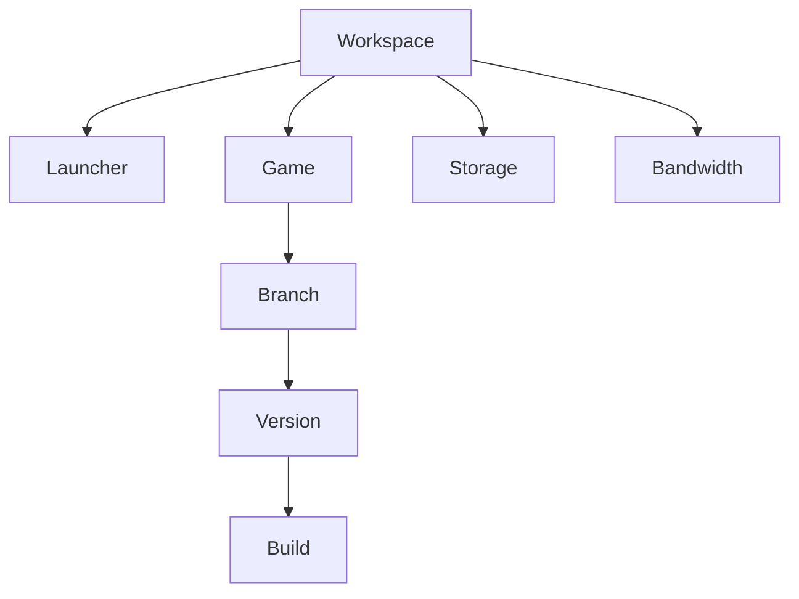

# Core concepts

| Concept | Description |
| --- | --- |
| **Workspace** | Main container for launchers, games, members, billing, usage, and permissions. |
| **Launcher** | Desktop application players use to install, update, and start games. |
| **Game** | Distributable product with metadata, branches, builds, and launch settings. |
| **Branch** | Release channel such as stable, beta, alpha, development, or private. |
| **Build** | Packaged runtime files scanned by the interactive CLI. |
| **Version** | Published state identified by a number, release type, and changelog. |
| **Storage** | Space consumed by retained game files and builds. |
| **Bandwidth** | Data transferred when players download or update games. |

<Frame caption="Workspace, launcher, game, branch, version, and build relationship">

</Frame>