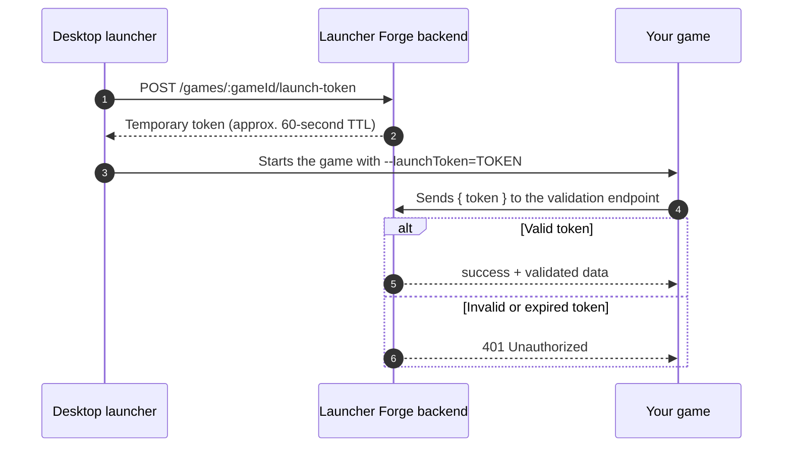

# Launch tokens

**Launch tokens** are temporary credentials used to validate the technical connection between the **launcher** and the **game** during startup.

Their purpose is to allow the game to confirm that it was launched through Launcher Forge and that the token supplied by the launcher is still valid.

<Info>
  A launch token works as a temporary startup pass between the launcher and the game runtime.
</Info>

## What a launch token validates

The validation flow connects four components:

- The desktop launcher.
- The Launcher Forge backend.
- The game executable.
- The validation integration installed in the game.

It does not replace:

- End-user registration.
- Launcher sign-in.
- Game ownership.
- CD key redemption.
- The player's library.

Those processes belong to other modules. The launch token is used specifically to validate startup between the launcher and the game.

## General flow

```text
The launcher requests a token
        ↓
The backend generates a temporary token
        ↓
The launcher starts the game
        ↓
The game reads the token at startup
        ↓
The game sends the token to the backend
        ↓
The backend validates the token
        ↓
The game receives the result
```

## Architecture diagram



## Process summary

| Step | Component | Action |
| --- | --- | --- |
| 1 | Launcher | Requests a token for the selected game. |
| 2 | Backend | Generates and returns a temporary token. |
| 3 | Launcher | Starts the executable and passes the token as an argument. |
| 4 | Game | Reads the argument during startup. |
| 5 | Game | Sends the token to the backend for validation. |
| 6 | Backend | Returns a valid response or a `401` error. |

## 1. The launcher requests the token

When the player selects **Play**, the launcher sends a request to the backend to generate a temporary token for the selected game.

### Generation endpoint

```http
POST /games/:gameId/launch-token
```

The `:gameId` parameter identifies the game that will be started.

Conceptual example:

```http
POST /games/42/launch-token
```

The launcher performs this request using its internal session and context.

<Warning>
  This endpoint is part of the launcher's internal flow. The game client should not call it manually to generate launch tokens.
</Warning>

## 2. The backend generates a temporary token

The backend creates a token with a short lifetime.

In the current flow, the approximate TTL is:

```text
60 seconds
```

The limited lifetime reduces the possibility of reusing an old token outside the intended launch flow.

The launcher should start the game immediately after receiving it.

## 3. The launcher starts the game

After receiving the token, the launcher starts the game and appends the token to the process arguments.

Startup contract:

```text
--launchToken=TOKEN
```

Conceptual example:

```text
MyGame.exe --launchToken=eyJhbGciOi...
```

<Warning>
  Never expose the real token in public screenshots, player-facing messages, or production logs.
</Warning>

## 4. The game reads the argument

During startup, the game integration must look for:

```text
--launchToken
```

The game must:

1. Read the process arguments.
2. Detect `--launchToken=...`.
3. Extract the token value.
4. Confirm that it is not empty.
5. Send it to the validation endpoint.

The presence of the argument does not mean the token is valid. Validation only succeeds after the backend confirms it.

## 5. The game sends the token to the backend

The game sends the token in the body of a `POST` request.

### Request body

```json
{
  "token": "LAUNCH_TOKEN"
}
```

The exact validation endpoint depends on the current backend and engine integration configuration.

The expected request contract is:

```text
POST { token }
```

## 6. Successful response

When validation succeeds, the backend returns the validation status and the initial validated data.

### Response contract

```json
{
  "success": true,
  "data": {
    "id": "player-id",
    "email": "player@example.com",
    "valid": true
  }
}
```

### Available fields

| Field | Type | Description |
| --- | --- | --- |
| `success` | `boolean` | Indicates whether the request was processed successfully. |
| `data.id` | `string` | Identifier included in the validated result. |
| `data.email` | `string` | Email associated with the validated context. |
| `data.valid` | `boolean` | Confirms whether the launch token is valid. |

<Info>
  The connection is considered validated when the request succeeds and `data.valid` is `true`.
</Info>

## 7. Invalid or expired token

When the token is invalid, has expired, or is used outside the expected flow, the backend returns `401 Unauthorized`.

```json
{
  "message": "Token inválido o expirado",
  "error": "Unauthorized",
  "statusCode": 401
}
```

The game must treat this response as an unvalidated launch.

## Recommended error behavior

When validation fails, the game should:

- Stop the flow that requires a validated launcher connection.
- Display a short and understandable message.
- Return to a safe screen or close the protected flow.
- Record only the technical information needed for diagnostics.
- Never print the complete token.

Example player-facing message:

```text
The game launch could not be validated through the launcher.
```

Do not display:

- The token.
- Authorization headers.
- Private URLs.
- Complete internal backend responses.
- Backend stack traces.

## Integration states

The integration should distinguish at least these states:

| State | Meaning |
| --- | --- |
| `NotStarted` | Validation has not started. |
| `ReadingToken` | The game is looking for the token in the process arguments. |
| `Validating` | The token was sent to the backend. |
| `Validated` | The backend confirmed a valid connection. |
| `MissingToken` | The game was started without a launch token. |
| `ExpiredToken` | The backend rejected an invalid or expired token. |
| `NetworkError` | The backend could not be reached. |
| `ValidationFailed` | The response did not match the expected contract. |

## Game-side logic

```text
Game starts
        ↓
Does --launchToken exist?
   ├── No → Unvalidated launch
   └── Yes
        ↓
Send token to the backend
        ↓
HTTP 200 and data.valid = true?
   ├── Yes → Launcher-game connection validated
   └── No
        ↓
HTTP 401?
   ├── Yes → Invalid or expired token
   └── No → Network or validation error
```

## Security best practices

### Treat it as a temporary credential

Even with a short lifetime, the launch token must be protected while it exists.

Do not store it in:

- Configuration files.
- Local databases.
- Player preferences.
- Production logs.
- Screenshots.
- Error messages.

### Do not trust the argument alone

A user can manually start an executable with a fabricated argument.

The game must send the value to the backend and wait for a valid response.

### Do not reuse tokens

The game should not store the token for future launches.

Each launch from Launcher Forge must generate a new token.

### Handle expiration

The launcher should start the game immediately after generating the token.

The game should begin validation as early as possible during initialization.

### Handle network failures

A connection failure must never be treated as a successful validation.

Distinguish between:

- Invalid token.
- Expired token.
- Backend unavailable.
- Request timeout.
- Unexpected response.

## Engine integrations

The general logic is the same for every engine:

1. Read `--launchToken`.
2. Extract the token.
3. Send `{ token }` to the backend.
4. Check the HTTP status.
5. Confirm `success`.
6. Confirm `data.valid`.
7. Continue or reject the protected flow.

<CardGroup cols={2}>
  <Card
    title="Unreal Engine"
    icon="gamepad"
    href="/en/engine-integrations/unreal-engine"
  >
    Configure the plugin, read the token during startup, and validate the launcher connection from Unreal Engine.
  </Card>

  <Card
    title="Unity"
    icon="cube"
    href="/en/engine-integrations/unity"
  >
    Configure the package, read the process arguments, and validate the launcher connection from Unity.
  </Card>
</CardGroup>

## Validation checklist

Before publishing a distributable build, verify:

- The game reads `--launchToken`.
- The token is extracted without extra characters.
- The request body uses `{ "token": "..." }`.
- The backend returns the expected contract.
- `data.valid` must be `true`.
- `401` responses are handled correctly.
- Network errors are not treated as success.
- The token does not appear in production logs.
- The game displays a controlled message when validation fails.
- Validation is tested by launching the game from Launcher Forge.

<Check>
  The integration is ready when the game correctly distinguishes a validated launch, an invalid token, a missing token, and a connection error.
</Check>

## Next step

Select the integration for your game engine:

<CardGroup cols={2}>
  <Card
    title="Integrate with Unreal Engine"
    icon="gamepad"
    href="/en/engine-integrations/unreal-engine"
  >
    Implement the launch-token flow with the Launcher Forge plugin for Unreal Engine.
  </Card>

  <Card
    title="Integrate with Unity"
    icon="cube"
    href="/en/engine-integrations/unity"
  >
    Implement the launch-token flow with the Launcher Forge package for Unity.
  </Card>
</CardGroup>
