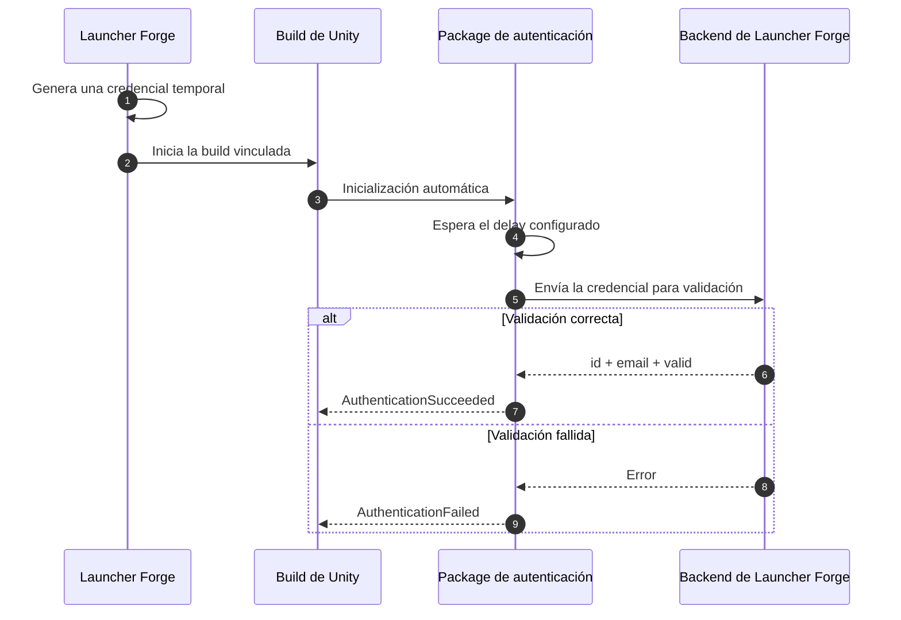
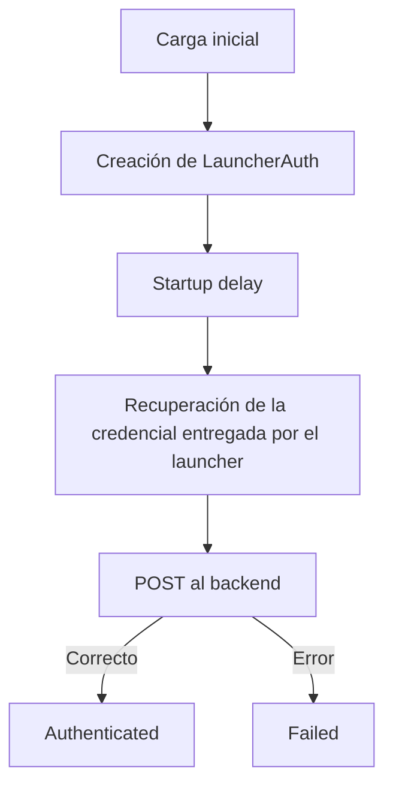

# Integración con Unity

**LauncherForge Launch Authentication** permite validar si una build de Unity fue iniciada desde una sesión autorizada de Launcher Forge.

La integración puede utilizarse para condicionar el acceso al juego o a funciones específicas hasta que el backend confirme la conexión entre el launcher y el ejecutable.

<Card
  title="Comprender los launch tokens"
  icon="shield-halved"
  href="/es/player-authentication/launch-tokens"
>
  Revisa cómo Launcher Forge genera y valida automáticamente la credencial temporal utilizada durante el inicio del juego.
</Card>

<Note>
  La credencial temporal es generada y entregada automáticamente por Launcher Forge. No debe introducirse manualmente ni utilizarse como un método de prueba.

  Presionar **Play** dentro del Unity Editor o ejecutar directamente la build no reproduce una autenticación real.
</Note>

## Cómo funciona



## Requisitos

Antes de comenzar, confirma:

- El juego existe y está publicado en Launcher Forge.
- El juego está vinculado con el launcher.
- Tienes una versión de Unity compatible con el package.
- El proyecto puede utilizar packages locales.
- Conoces la URL del endpoint de validación.
- La prueba final se realizará con una build publicada e iniciada desde Launcher Forge.

## Instalación en Unity

<Card
  title="Descargar LauncherForge Launch Authentication 1.0.2"
  icon="download"
  href="https://discord.com/invite/2DwJtD9E3T"
>
  

  Puedes encontrar el link de descarga a través de nuestro Discord, en la sección **DOWNLOAD PLUGIN**, y buscas el canal correspondiente al de tu motor gráfico.

  Para esta integración, abre el canal:

  ```text
  # unity
  ```
</Card>

### Instalar el package

El package puede instalarse copiándolo dentro del proyecto o seleccionando su `package.json` desde Unity Package Manager.

<Tabs>
  <Tab title="Copiar dentro de Packages">
    <Steps>
      <Step title="Descomprime el archivo">
        Descomprime:

        ```text
        LauncherForge_LauncherAuth_Unity_1.0.2.zip
        ```
      </Step>

      <Step title="Renombra la carpeta">
        La carpeta obtenida se llama:

        ```text
        com.launcherforge.launcherauth-1.0.2
        ```

        Renómbrala exactamente como:

        ```text
        com.launcherforge.launcherauth
        ```
      </Step>

      <Step title="Copia el package al proyecto">
        Coloca la carpeta dentro de `Packages`:

        ```text
        TuProyectoUnity/
        ├── Assets/
        ├── Packages/
        │   └── com.launcherforge.launcherauth/
        ├── ProjectSettings/
        └── UserSettings/
        ```
      </Step>

      <Step title="Comprueba la estructura">
        El package debe contener:

        ```text
        Packages/
        └── com.launcherforge.launcherauth/
            ├── package.json
            ├── README.md
            ├── CHANGELOG.md
            └── Runtime/
                ├── LauncherAuthBootstrap.cs
                ├── LauncherAuthModels.cs
                ├── LauncherAuthSession.cs
                ├── LauncherAuthSettings.cs
                ├── LaunchTokenReader.cs
                └── LauncherForge.LauncherAuth.asmdef
        ```
      </Step>
    </Steps>

    <Frame caption="Package copiado dentro de la carpeta Packages">
      
    </Frame>
  </Tab>

  <Tab title="Package Manager">
    <Steps>
      <Step title="Abre Package Manager">
        En Unity, abre:

        ```text
        Window → Package Manager
        ```
      </Step>

      <Step title="Selecciona Install package from disk">
        Presiona el botón `+` y selecciona:

        ```text
        Install package from disk
        ```
      </Step>

      <Step title="Selecciona package.json">
        Abre:

        ```text
        com.launcherforge.launcherauth/package.json
        ```
      </Step>

      <Step title="Confirma la instalación">
        El package debe aparecer en Package Manager como:

        ```text
        LauncherForge Launch Authentication 1.0.2
        ```
      </Step>
    </Steps>

    <Frame caption="LauncherForge Launch Authentication instalado en Package Manager">
      
    </Frame>
  </Tab>
</Tabs>

---

## Crear la configuración

El package carga su configuración automáticamente desde `Resources`.

<Steps>
  <Step title="Crea la carpeta Resources">
    Dentro de `Assets`, crea:

    ```text
    Assets/Resources/
    ```
  </Step>

  <Step title="Crea Launcher Auth Settings">
    Dentro de `Resources`, utiliza:

    ```text
    Create → LauncherForge → Launcher Auth Settings
    ```
  </Step>

  <Step title="Asigna el nombre exacto">
    El asset debe llamarse:

    ```text
    LauncherAuthSettings
    ```
  </Step>

  <Step title="Comprueba la ruta final">
    La ubicación debe ser:

    ```text
    Assets/Resources/LauncherAuthSettings.asset
    ```
  </Step>
</Steps>

El nombre y la ruta son obligatorios porque el package carga el asset mediante:

```csharp
Resources.Load<LauncherAuthSettings>(
    "LauncherAuthSettings"
);
```

<Warning>
  Si cambias el nombre del asset o lo mueves fuera de `Assets/Resources`, el package no podrá cargar la configuración automáticamente.
</Warning>

## Configurar el backend

Selecciona:

```text
Assets/Resources/LauncherAuthSettings.asset
```

En el Inspector encontrarás:

<ResponseField name="Backend Url" type="string">
  URL completa del endpoint de validación.
</ResponseField>

<ResponseField name="Startup Delay Seconds" type="float">
  Tiempo que espera el package antes de iniciar la validación.
</ResponseField>

<ResponseField name="Timeout Seconds" type="float">
  Tiempo máximo de espera para la solicitud HTTP.
</ResponseField>

Configuración recomendada:

```text
Backend Url:
https://backend.launcherforge.io/api/v1/games/auth/validate-launch-token

Startup Delay Seconds:
0.5

Timeout Seconds:
10
```

La solicitud interna utiliza el contrato esperado por el backend:

```json
{
  "token": "TEMPORARY_CREDENTIAL"
}
```

<Note>
  El package construye esta solicitud automáticamente. No necesitas enviar el request desde otro script ni pedir al jugador que introduzca una credencial.
</Note>

---

## Inicialización automática

No agregues el package manualmente a un `GameObject`.

Al cargar el juego, el package crea automáticamente:

```text
[LauncherAuth]
```

Internamente utiliza:

```csharp
RuntimeInitializeOnLoadMethod
```

El objeto permanece activo al cambiar de escena mediante:

```csharp
DontDestroyOnLoad
```

El flujo interno es:



---

## Estados disponibles

Importa el namespace:

```csharp
using LauncherForge.LauncherAuth;
```

El estado actual está disponible mediante:

```csharp
LauncherAuthSession.State
```

| Estado | Descripción |
| --- | --- |
| `LauncherAuthState.NotStarted` | La inicialización todavía no comenzó. |
| `LauncherAuthState.WaitingForStartup` | El package espera el delay configurado. |
| `LauncherAuthState.ReadingToken` | El package recupera la credencial de inicio. |
| `LauncherAuthState.Validating` | La solicitud está siendo validada por el backend. |
| `LauncherAuthState.Authenticated` | La autenticación terminó correctamente. |
| `LauncherAuthState.Failed` | La autenticación no pudo completarse. |

## Datos autenticados

Después de una validación correcta, el usuario está disponible en:

```csharp
LauncherAuthSession.User
```

Campos disponibles:

```csharp
LauncherAuthSession.User.id
LauncherAuthSession.User.email
LauncherAuthSession.User.valid
```

El identificador es un `string`:

```csharp
string userId = LauncherAuthSession.User.id;
```

<ResponseField name="id" type="string">
  Identificador autenticado devuelto por el backend.
</ResponseField>

<ResponseField name="email" type="string">
  Correo asociado con la sesión validada.
</ResponseField>

<ResponseField name="valid" type="boolean">
  Confirma que la credencial fue aceptada.
</ResponseField>

---

## Consultar el resultado actual

Puedes consultar el estado de la sesión desde cualquier script que importe el namespace.

```csharp
using LauncherForge.LauncherAuth;
using UnityEngine;

public sealed class LauncherAuthExample : MonoBehaviour
{
    private void Start()
    {
        if (LauncherAuthSession.IsAuthenticated)
        {
            LauncherAuthenticatedUser user =
                LauncherAuthSession.User;

            Debug.Log(
                $"Authenticated user: {user.id}"
            );

            Debug.Log(
                $"Email: {user.email}"
            );

            Debug.Log(
                $"Valid: {user.valid}"
            );
        }
    }
}
```

<Warning>
  No es recomendable depender únicamente de un `if` ejecutado una vez en `Start`, porque la validación puede seguir en curso. Para reaccionar inmediatamente, utiliza los eventos del package.
</Warning>

## Comprobar un error

No existe una propiedad llamada:

```csharp
LauncherAuthSession.Failed
```

La comprobación correcta es:

```csharp
if (
    LauncherAuthSession.State ==
    LauncherAuthState.Failed
)
{
    string error =
        LauncherAuthSession.LastError;

    Debug.LogError(error);
}
```

Ejemplo combinado:

```csharp
if (LauncherAuthSession.IsAuthenticated)
{
    LauncherAuthenticatedUser user =
        LauncherAuthSession.User;

    // El juego decide cómo continuar.
}
else if (
    LauncherAuthSession.State ==
    LauncherAuthState.Failed
)
{
    string error =
        LauncherAuthSession.LastError;

    // El juego decide cómo mostrar el error.
}
```

---

## Utilizar los eventos de autenticación

Esta es la forma recomendada para un menú principal o para un controlador que deba reaccionar apenas termine la validación.

```csharp
using LauncherForge.LauncherAuth;
using UnityEngine;

public sealed class LauncherAuthMenuController : MonoBehaviour
{
    private void OnEnable()
    {
        LauncherAuthSession.AuthenticationSucceeded +=
            HandleAuthenticationSucceeded;

        LauncherAuthSession.AuthenticationFailed +=
            HandleAuthenticationFailed;

        EvaluateCurrentState();
    }

    private void OnDisable()
    {
        LauncherAuthSession.AuthenticationSucceeded -=
            HandleAuthenticationSucceeded;

        LauncherAuthSession.AuthenticationFailed -=
            HandleAuthenticationFailed;
    }

    private void EvaluateCurrentState()
    {
        if (LauncherAuthSession.IsAuthenticated)
        {
            HandleAuthenticationSucceeded(
                LauncherAuthSession.User
            );
            return;
        }

        if (
            LauncherAuthSession.State ==
            LauncherAuthState.Failed
        )
        {
            HandleAuthenticationFailed(
                LauncherAuthSession.LastError
            );
        }
    }

    private static void HandleAuthenticationSucceeded(
        LauncherAuthenticatedUser user)
    {
        Debug.Log(
            $"Authentication succeeded. " +
            $"User ID: {user.id}"
        );

        // El juego decide qué hacer:
        // - habilitar Play
        // - cargar el menú
        // - habilitar funciones online
        // - cargar otra escena
    }

    private static void HandleAuthenticationFailed(
        string error)
    {
        Debug.LogError(
            $"Authentication failed: {error}"
        );

        // El juego decide qué hacer:
        // - mostrar un error
        // - desactivar opciones online
        // - mostrar un botón para cerrar
        // - regresar al launcher
    }
}
```

<Info>
  `EvaluateCurrentState()` es importante porque la autenticación podría haber finalizado antes de que el objeto se suscribiera a los eventos.
</Info>

---

## Comportamiento dentro del Unity Editor

Al presionar **Play** directamente en el editor, el resultado esperado es un estado de acceso denegado.

Esto no representa un error del package. Confirma que:

- La inicialización automática funcionó.
- El package intentó recuperar la credencial de inicio.
- El editor no recibió una credencial generada por Launcher Forge.
- `LauncherAuthSession.State` cambió a `LauncherAuthState.Failed`.
- El mensaje quedó disponible en `LauncherAuthSession.LastError`.

<Warning>
  El package no contiene un `TokenOverride` para el Editor. La autenticación real no puede probarse desde el botón Play del editor.
</Warning>

<Frame caption="Resultado esperado cuando la build no fue iniciada desde Launcher Forge">
  
</Frame>

## Probar una autenticación real

Para comprobar la integración completa:

<Steps>
  <Step title="Genera una build de Unity">
    Compila el proyecto con todos los archivos requeridos para ejecutarlo fuera del editor.
  </Step>

  <Step title="Publica la build">
    Sube la versión mediante Launcher Forge CLI.
  </Step>

  <Step title="Vincula el juego">
    Confirma que el juego publicado está asociado con el launcher correcto.
  </Step>

  <Step title="Instala el juego desde el launcher">
    Utiliza una cuenta de jugador con acceso al juego.
  </Step>

  <Step title="Inicia la build desde Launcher Forge">
    El launcher generará y entregará automáticamente la credencial temporal.
  </Step>

  <Step title="Comprueba el resultado">
    La sesión debe quedar autenticada y el evento `AuthenticationSucceeded` debe ejecutarse.
  </Step>
</Steps>

<Frame caption="Autenticación correcta en una build iniciada desde Launcher Forge">
  
</Frame>

Cuando el backend responde correctamente:

```json
{
  "success": true,
  "data": {
    "id": "12345",
    "email": "user@example.com",
    "valid": true
  }
}
```

El package establece:

```csharp
LauncherAuthSession.IsAuthenticated == true
```

```csharp
LauncherAuthSession.State ==
    LauncherAuthState.Authenticated
```

El usuario queda disponible en:

```csharp
LauncherAuthSession.User
```

## Resultado de una autenticación fallida

La validación puede fallar por:

- Credencial ausente.
- Credencial inválida.
- Credencial expirada.
- Backend no disponible.
- Timeout.
- Respuesta JSON inválida.
- `valid == false`.
- `id` vacío o ausente.

El package establece:

```csharp
LauncherAuthSession.IsAuthenticated == false
```

```csharp
LauncherAuthSession.State ==
    LauncherAuthState.Failed
```

El mensaje queda disponible en:

```csharp
LauncherAuthSession.LastError
```

<Info>
  El package no cierra automáticamente el juego. Tu proyecto decide si muestra un error, desactiva funciones, ofrece cerrar la aplicación o permite continuar con capacidades limitadas.
</Info>

---

## Solución de problemas

<AccordionGroup>
  <Accordion title="El package no aparece en Package Manager">
    Comprueba que:

    - La carpeta se llame `com.launcherforge.launcherauth`.
    - `package.json` esté en la raíz del package.
    - Seleccionaste el archivo correcto mediante **Install package from disk**.
    - La versión de Unity sea compatible.
  </Accordion>

  <Accordion title="LauncherAuthSettings no se carga">
    Confirma la ruta y nombre exactos:

    ```text
    Assets/Resources/LauncherAuthSettings.asset
    ```

    El asset debe llamarse exactamente `LauncherAuthSettings`.
  </Accordion>

  <Accordion title="La sesión permanece en Failed dentro del Editor">
    Este es el resultado esperado. El editor no recibe una credencial temporal de Launcher Forge y no existe un override para simularla.

    Realiza la prueba final con una build publicada, vinculada e iniciada desde el launcher.
  </Accordion>

  <Accordion title="El backend no responde">
    Revisa:

    - `Backend Url`.
    - Disponibilidad del backend.
    - Certificado HTTPS.
    - Valor de `Timeout Seconds`.
    - Conectividad de la build.
  </Accordion>

  <Accordion title="La autenticación termina antes de que el menú escuche los eventos">
    Llama `EvaluateCurrentState()` después de suscribirte. Así procesas un resultado que pudo completarse antes de `OnEnable`.
  </Accordion>

  <Accordion title="La build se abre, pero no se autentica">
    Confirma que:

    - La build fue publicada mediante la CLI.
    - El juego está vinculado con el launcher correcto.
    - Se configuró el ejecutable principal correcto.
    - La build fue iniciada desde Launcher Forge.
    - El asset de configuración está incluido en `Resources`.
  </Accordion>
</AccordionGroup>

---

## Licencia y proyecto de ejemplo

<Warning>
  Según el documento de integración, el package se entrega gratuitamente y no puede comercializarse ni revenderse.
</Warning>

<Card
  title="Descargar UnityThirdPersonAuthTest"
  icon="flask"
  href="https://discord.com/invite/2DwJtD9E3T"
>
  

  Puedes encontrar el link de descarga a través de nuestro Discord, en la sección **DOWNLOAD TEMPLATES**, y buscas el canal correspondiente al de tu motor gráfico.

  Para el proyecto de ejemplo de Unity, abre el canal:

  ```text
  # thid-person-auth-test-unity
  ```
</Card>

<Note>
  `UnityThirdPersonAuthTest` incluye el package y una integración preparada para realizar pruebas con Unity 6 o una versión compatible.
</Note>

## Lista de verificación

- El package está dentro de `Packages/com.launcherforge.launcherauth`.
- Package Manager muestra LauncherForge Launch Authentication.
- Existe `Assets/Resources/LauncherAuthSettings.asset`.
- `Backend Url` contiene el endpoint completo.
- `Startup Delay Seconds` está configurado en `0.5`.
- `Timeout Seconds` está configurado en `10`.
- No agregaste un bootstrap manual a un GameObject.
- El código importa `LauncherForge.LauncherAuth`.
- El menú utiliza eventos o evalúa el estado actual.
- El proyecto controla `Authenticated` y `Failed`.
- No intentas introducir una credencial manualmente.
- La prueba final se realiza con una build vinculada e iniciada desde Launcher Forge.

<Check>
  La integración está lista cuando la build iniciada desde Launcher Forge ejecuta `AuthenticationSucceeded`, expone `id`, `email` y `valid`, y tu juego controla correctamente el estado `Failed`.
</Check>

## Guías relacionadas

<CardGroup cols={3}>
  <Card
    title="Launch tokens"
    icon="shield-halved"
    href="/es/game-authentication/launch-tokens"
  >
    Comprende la validación automática entre el launcher y el juego.
  </Card>

  <Card
    title="Publicar tu primera build"
    icon="cloud-arrow-up"
    href="/es/getting-started/publish-first-build"
  >
    Publica la build de Unity mediante la CLI interactiva.
  </Card>

  <Card
    title="Probar tu launcher"
    icon="flask"
    href="/es/getting-started/test-launcher"
  >
    Verifica instalación, descarga e inicio desde Launcher Forge.
  </Card>
</CardGroup>
