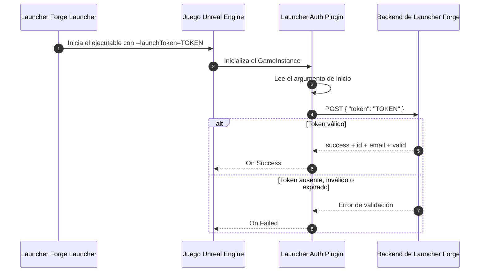
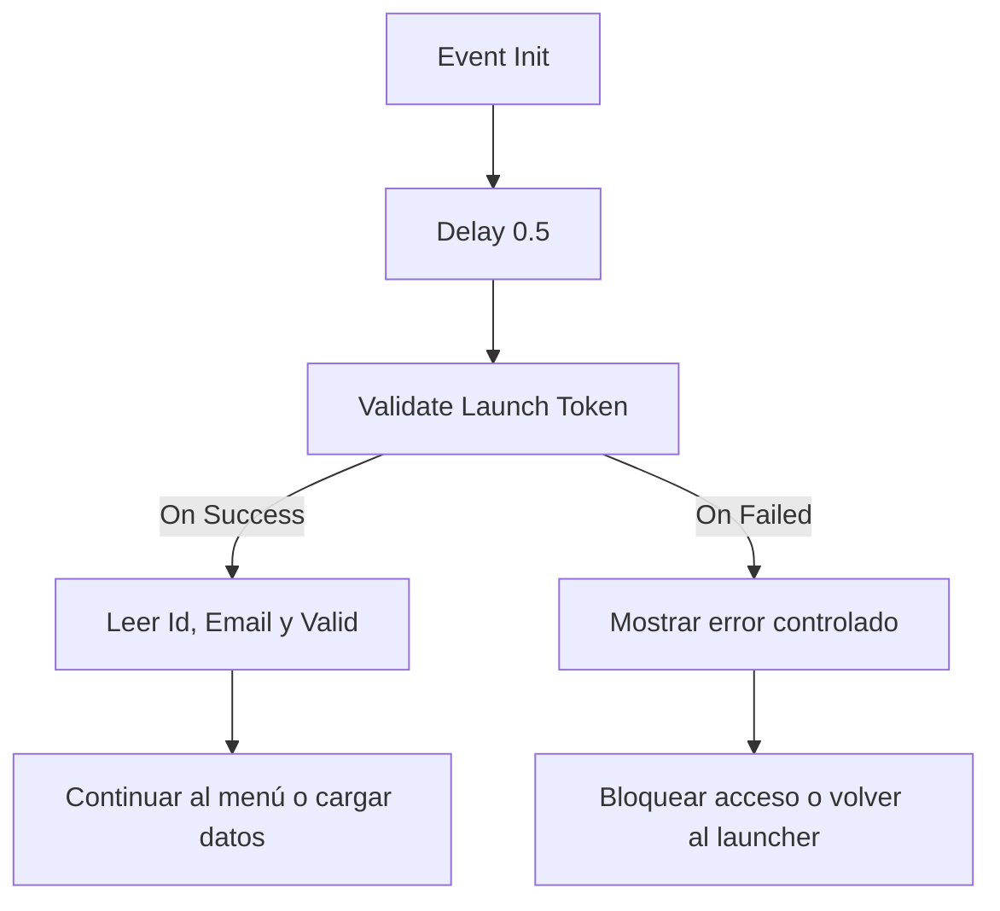

# Integración con Unreal Engine

**Launcher Auth Plugin** permite que un juego desarrollado con Unreal Engine valide si fue iniciado desde una sesión autorizada de Launcher Forge.

Cuando el jugador inicia el juego desde el launcher:

1. Launcher Forge genera un token temporal.
2. El launcher entrega el token al ejecutable mediante `--launchToken`.
3. El plugin lee el argumento al iniciar.
4. El juego envía el token al endpoint de validación.
5. El backend responde con los datos validados.
6. Blueprint o C++ continúa según el resultado.

<Card
  title="Comprender los launch tokens"
  icon="shield-halved"
  href="/es/game-authentication/launch-tokens"
>
  Revisa el flujo completo de generación, entrega y validación del token temporal entre el launcher y el juego.
</Card>

<Warning>
  La validación descrita en esta guía corresponde a la conexión técnica entre el **launcher** y el **juego**.

  No reemplaza el registro, inicio de sesión, propiedad del juego ni canje de CD keys de los usuarios finales.
</Warning>

## Arquitectura de validación



## Datos disponibles

Después de una validación correcta, el plugin expone únicamente los datos necesarios de la sesión:

| Campo | Tipo | Descripción |
| --- | --- | --- |
| `Id` | `string` | Identificador autenticado devuelto por el backend. |
| `Email` | `string` | Correo asociado con la sesión validada. |
| `Valid` | `boolean` | Confirma que el launch token fue aceptado. |

El plugin no expone como campos separados:

- `username`
- `userId`
- `gameId`
- `launcherId`

---

## Antes de comenzar

Comprueba lo siguiente:

- El juego fue creado y publicado en Launcher Forge.
- El juego está vinculado con el launcher.
- La integración de launch tokens está habilitada en el backend.
- Tienes la URL del endpoint de validación.
- El plugin corresponde a la misma versión de Unreal Engine utilizada por el proyecto.
- El proyecto puede compilar plugins C++.

Ejemplo de endpoint:

```text
http://backend.launcherforge.io/api/v1/games/auth/validate-launch-token
```

---

## Instalar Launcher Auth Plugin

<Tabs>
  <Tab title="Instalación desde Fab">
    Después de agregar el plugin a tu biblioteca de Fab, instálalo en la versión de Unreal Engine utilizada por el proyecto.

    <Steps>
      <Step title="Abre Epic Games Launcher">
        Inicia Epic Games Launcher con la cuenta que contiene el plugin.
      </Step>

      <Step title="Abre la biblioteca de Fab">
        Ve a tu biblioteca y busca **Forge Launcher Auth**.
      </Step>

      <Step title="Instala el plugin">
        Selecciona la misma versión de Unreal Engine utilizada por el proyecto.
      </Step>

      <Step title="Abre el proyecto">
        Inicia el proyecto desde Unreal Engine.
      </Step>

      <Step title="Activa el plugin">
        Ve a **Edit → Plugins**, busca **Launcher Auth Plugin** y actívalo.
      </Step>

      <Step title="Reinicia Unreal Engine">
        Reinicia el editor cuando Unreal Engine lo solicite.
      </Step>
    </Steps>

    {/* PHOTO AREA: Fab Library showing Forge Launcher Auth. */}
    <Frame caption="Forge Launcher Auth dentro de la biblioteca de Fab">
      
    </Frame>

    {/* PHOTO AREA: Epic Games Launcher showing the installed engine version. */}
    <Frame caption="Plugin instalado para una versión específica de Unreal Engine">
      
    </Frame>

    {/* PHOTO AREA: Unreal Engine Plugin Browser with plugin enabled. */}
    <Frame caption="Launcher Auth Plugin activado en Unreal Engine">
      
    </Frame>
  </Tab>

  <Tab title="Instalación manual">
    También puedes instalar el plugin directamente dentro del proyecto.

    <Note>
      Utiliza el paquete compilado para la versión exacta de Unreal Engine utilizada por tu proyecto.
    </Note>

    {/* TODO: Añadir aquí los enlaces oficiales de descarga para UE 5.5, 5.6, 5.7 y 5.8. */}

    <Steps>
      <Step title="Descarga el paquete correcto">
        Descarga `LauncherAuthPlugin.zip` correspondiente a la versión de Unreal Engine del proyecto.
      </Step>

      <Step title="Abre la carpeta del proyecto">
        Ve a la carpeta que contiene `YourProject.uproject`.
      </Step>

      <Step title="Crea la carpeta Plugins">
        Si no existe, crea una carpeta llamada:

        ```text
        Plugins
        ```
      </Step>

      <Step title="Descomprime el plugin">
        Descomprime el paquete dentro de la carpeta `Plugins`.

        La estructura debería quedar similar a:

        ```text
        YourProject/
        ├── YourProject.uproject
        └── Plugins/
            └── LauncherAuthPlugin/
                ├── LauncherAuthPlugin.uplugin
                ├── Binaries/
                ├── Resources/
                └── Source/
        ```
      </Step>

      <Step title="Regenera los archivos del proyecto">
        En proyectos Blueprint o C++, haz clic derecho sobre `YourProject.uproject` y selecciona:

        ```text
        Generate Visual Studio project files
        ```
      </Step>

      <Step title="Recompila el proyecto">
        Abre `YourProject.sln` y compila nuevamente el proyecto.
      </Step>

      <Step title="Confirma la activación">
        Abre Unreal Engine, ve a **Edit → Plugins** y confirma que **Launcher Auth Plugin** está activado.
      </Step>
    </Steps>

    {/* PHOTO AREA: Project directory showing the Plugins folder. */}
    <Frame caption="Plugin instalado dentro de la carpeta Plugins del proyecto">
      
    </Frame>

    {/* PHOTO AREA: Unreal Engine Plugin Browser with plugin enabled. */}
    <Frame caption="Launcher Auth Plugin listo para utilizarse">
      
    </Frame>
  </Tab>
</Tabs>

## Compatibilidad de versiones

Launcher Auth Plugin es un plugin C++.

Los binarios precompilados dependen de la versión de Unreal Engine para la cual fueron generados.

<Warning>
  Un paquete compilado para una versión del motor no garantiza compatibilidad automática con versiones posteriores.
</Warning>

Utiliza siempre el paquete correspondiente a la versión exacta del proyecto.

Según el documento de integración actual, las versiones **Unreal Engine 5.6 o superiores** deben validarse antes de considerarse oficialmente compatibles.

---

## Configurar un GameInstance personalizado

El lugar recomendado para iniciar la validación es un Blueprint basado en `GameInstance`.

Esto permite validar la conexión antes de cargar:

- Datos del jugador.
- Menús online.
- Partidas guardadas.
- Servicios protegidos.
- Sistemas que dependan de una sesión autorizada.

## 1. Crea el GameInstance

<Steps>
  <Step title="Crea una clase Blueprint">
    Crea un Blueprint basado en `GameInstance`.
  </Step>

  <Step title="Asigna un nombre">
    Por ejemplo:

    ```text
    BP_GameInstance
    ```
  </Step>

  <Step title="Abre Project Settings">
    Ve a **Edit → Project Settings**.
  </Step>

  <Step title="Abre Maps & Modes">
    Busca la sección **Maps & Modes**.
  </Step>

  <Step title="Asigna Game Instance Class">
    En **Game Instance Class**, selecciona `BP_GameInstance`.
  </Step>
</Steps>

{/* PHOTO AREA: Project Settings > Maps & Modes > Game Instance Class. */}
<Frame caption="Game Instance Class configurado en Project Settings">
  
</Frame>

## 2. Configura Event Init

Abre `BP_GameInstance` y crea este flujo:

```text
Event Init
    ↓
Delay 0.5
    ↓
Validate Launch Token
```

<Warning>
  Agrega un `Delay` de **0.5 segundos** antes de llamar `Validate Launch Token`.

  En builds empaquetadas, algunos sistemas de inicio pueden no estar completamente inicializados en el momento exacto en que se ejecuta `Event Init`.
</Warning>

Sin este delay, el plugin puede:

- No encontrar `--launchToken`.
- Fallar al acceder al subsystem.
- Devolver un error de autenticación aunque el launcher haya enviado correctamente el token.

{/* PHOTO AREA: Blueprint Event Init -> Delay 0.5 -> Validate Launch Token. */}
<Frame caption="Flujo recomendado dentro de BP_GameInstance">
  
</Frame>

---

## Configurar Validate Launch Token

El nodo principal del plugin es:

```text
Validate Launch Token
```

### Input

| Input | Descripción |
| --- | --- |
| **Backend Url** | URL completa del endpoint que valida el launch token. |

Ejemplo:

```text
http://backend.launcherforge.io/api/v1/games/auth/validate-launch-token
```

### Delegates de salida

| Delegate | Cuándo se ejecuta |
| --- | --- |
| **On Success** | El backend aceptó el token y devolvió datos válidos. |
| **On Failed** | El token falta, expiró, es inválido o falló la solicitud HTTP. |

## Flujo recomendado



### En On Success

Puedes:

- Guardar los datos autenticados durante la sesión.
- Continuar al menú principal.
- Cargar información específica.
- Habilitar sistemas protegidos.
- Permitir el acceso al juego.

### En On Failed

Puedes:

- Mostrar un error de autenticación.
- Bloquear el acceso.
- Indicar que el juego debe iniciarse desde Launcher Forge.
- Volver a una pantalla inicial.
- Cerrar el juego de forma controlada.

{/* PHOTO AREA: Complete Blueprint with success and failed branches. */}
<Frame caption="Blueprint completo con On Success y On Failed">
  
</Frame>

---

## Contrato del launch token

El token es generado por Launcher Forge cuando el jugador inicia el juego.

No debes:

- Guardarlo dentro del proyecto.
- Escribirlo directamente en Blueprint.
- Hardcodearlo en C++.
- Almacenarlo en archivos de configuración.
- Mostrarlo en la interfaz.
- Imprimirlo completo en logs de producción.

El launcher inicia el juego utilizando:

```text
--launchToken=TOKEN
```

No se requieren argumentos de lanzamiento adicionales para esta integración.

{/* PHOTO AREA: Game executable launched with --launchToken. */}
<Frame caption="Ejecutable iniciado con el argumento launchToken">
  
</Frame>

## Request enviado por el plugin

El plugin envía una solicitud HTTP con este body:

```json
{
  "token": "TOKEN"
}
```

<Note>
  La presencia del argumento no significa que la conexión ya esté validada. El juego debe esperar la respuesta del backend.
</Note>

{/* PHOTO AREA: Backend request inspector showing token body. */}
<Frame caption="Body enviado al endpoint de validación">
  
</Frame>

## Respuesta esperada

El backend debe responder con esta estructura:

```json
{
  "success": true,
  "data": {
    "id": "authenticated-id",
    "email": "player@example.com",
    "valid": true
  }
}
```

<ResponseField name="success" type="boolean">
  Indica que la solicitud fue procesada correctamente.
</ResponseField>

<ResponseField name="data.id" type="string">
  Identificador autenticado devuelto por el backend.
</ResponseField>

<ResponseField name="data.email" type="string">
  Correo asociado con la sesión validada.
</ResponseField>

<ResponseField name="data.valid" type="boolean">
  Confirma que el backend aceptó el launch token.
</ResponseField>

{/* PHOTO AREA: Break Struct or validated data in Blueprint. */}
<Frame caption="Datos disponibles después de una validación correcta">
  
</Frame>

---

## Uso en Blueprint

El flujo recomendado es:

```text
Event Init
    ↓
Delay 0.5
    ↓
Validate Launch Token
    ├── On Success
    └── On Failed
```

Ejemplo de lógica:

<Tabs>
  <Tab title="On Success">
    1. Confirma que `Valid` sea `true`.
    2. Guarda `Id` y `Email` cuando sean necesarios durante la sesión.
    3. Carga los sistemas dependientes de autenticación.
    4. Abre el menú principal o continúa el inicio.
  </Tab>

  <Tab title="On Failed">
    1. Muestra un mensaje breve.
    2. Bloquea los sistemas protegidos.
    3. Indica que el juego debe iniciarse desde Launcher Forge.
    4. Vuelve a una pantalla segura o cierra el juego.
  </Tab>
</Tabs>

Ejemplo de mensaje visible:

```text
No fue posible validar el inicio del juego desde Launcher Forge.
```

Evita mostrar al jugador:

- El token.
- La URL interna completa.
- Headers HTTP.
- Stack traces.
- Detalles sensibles del backend.

{/* PHOTO AREA: Print String or UI widget showing authenticated identity. */}
<Frame caption="Ejemplo de datos autenticados utilizados desde Blueprint">
  
</Frame>

---

## Uso en C++

El plugin está diseñado principalmente para Blueprint, pero un proyecto C++ también puede acceder a los datos de autenticación mediante las clases del plugin.

Casos habituales:

- Comprobar si la sesión fue validada.
- Leer los datos autenticados.
- Reaccionar ante éxito o error.
- Integrar la validación con sistemas propios del proyecto.

## Patrón recomendado

1. Espera aproximadamente `0.5` segundos después de la inicialización.
2. Accede al subsystem del plugin desde el `GameInstance`.
3. Inicia o espera la validación.
4. Lee los datos únicamente después de un resultado exitoso.
5. No continúes cuando la validación falle.

<Warning>
  La misma regla de inicialización se aplica en C++: evita validar exactamente en el primer instante de `Init`.
</Warning>

Ejemplo conceptual:

```cpp
UGameInstance* GameInstance = GetGameInstance();
if (!GameInstance)
{
    return;
}

// Accede al subsystem de Launcher Auth desde el GameInstance.
// Lee los datos solo después de una validación exitosa.
```

El documento fuente no define una API C++ pública completa ni nombres definitivos de métodos para este ejemplo. Utiliza las clases expuestas por la versión instalada del plugin.

{/* PHOTO AREA: IDE showing access to the plugin subsystem. */}
<Frame caption="Acceso al subsystem del plugin desde un proyecto C++">
  
</Frame>

---

## Probar la integración

La prueba principal debe realizarse con una build empaquetada iniciada desde Launcher Forge.

## Flujo recomendado

<Steps>
  <Step title="Empaqueta el juego">
    Genera primero una build de tipo **Development** para facilitar el diagnóstico.
  </Step>

  <Step title="Publica la build">
    Sube la versión mediante Launcher Forge CLI.
  </Step>

  <Step title="Abre el launcher">
    Inicia sesión con una cuenta de jugador válida.
  </Step>

  <Step title="Instala el juego">
    Descarga la build desde el launcher.
  </Step>

  <Step title="Inicia el juego">
    Selecciona **Play** y permite que Launcher Forge genere y entregue el token.
  </Step>

  <Step title="Comprueba el resultado">
    Verifica que `On Success` sea ejecutado y que `Valid` sea `true`.
  </Step>
</Steps>

<Info>
  Probar únicamente desde el editor no reproduce necesariamente el mismo orden de inicialización de una build empaquetada.
</Info>

### Prueba manual del argumento

Para una prueba técnica controlada, el ejecutable puede iniciarse con:

<CodeGroup>
```powershell PowerShell
.\YourGame.exe "--launchToken=TOKEN"
```

```text Command Prompt
YourGame.exe --launchToken=TOKEN
```
</CodeGroup>

<Warning>
  Utiliza únicamente un token temporal válido generado para la prueba. No guardes el token dentro del proyecto ni lo reutilices como configuración permanente.
</Warning>

---

## Errores frecuentes

<AccordionGroup>
  <Accordion title="La validación falla inmediatamente al iniciar">
    **Causa probable:** `Validate Launch Token` se ejecuta demasiado temprano desde `GameInstance Init`.

    **Solución:**

    ```text
    Event Init → Delay 0.5 → Validate Launch Token
    ```

    Confirma también que `BP_GameInstance` esté asignado en **Project Settings → Maps & Modes**.
  </Accordion>

  <Accordion title="El juego no encuentra el launch token">
    **Causa probable:** el ejecutable no fue iniciado con `--launchToken`.

    **Solución:**

    - Inicia el juego desde Launcher Forge.
    - Confirma que el launcher utiliza la build y ejecutable correctos.
    - Para una prueba manual:

    ```powershell
    .\YourGame.exe "--launchToken=TOKEN"
    ```
  </Accordion>

  <Accordion title="Funciona en el editor, pero falla en una packaged build">
    **Causa probable:** el orden de inicialización cambia en una build empaquetada.

    **Solución:**

    - Utiliza el delay recomendado de `0.5` segundos.
    - Prueba primero una build **Development**.
    - Revisa que el GameInstance personalizado esté configurado.
    - Comprueba que el plugin esté incluido en el empaquetado.
  </Accordion>

  <Accordion title="El backend responde HTTP 401">
    **Causa probable:**

    - Token inválido.
    - Token expirado.
    - Token firmado con otro secret.
    - Endpoint rechazó el token.

    **Solución:**

    - Inicia nuevamente el juego desde Launcher Forge para generar un token nuevo.
    - Confirma que el backend recibe:

    ```json
    {
      "token": "TOKEN"
    }
    ```

    - Confirma que el token no haya expirado.
    - Confirma que el backend utiliza la configuración correcta para validar launch tokens.
  </Accordion>

  <Accordion title="El backend responde HTTP 404">
    **Causa probable:** el valor de **Backend Url** es incorrecto.

    **Solución:**

    Revisa la URL configurada en `Validate Launch Token`.

    ```text
    http://backend.launcherforge.io/api/v1/games/auth/validate-launch-token
    ```
  </Accordion>

  <Accordion title="El nodo Validate Launch Token no aparece">
    **Causa probable:**

    - El plugin no está activado.
    - Unreal Engine necesita reiniciarse.
    - El proyecto C++ no fue recompilado.
    - El paquete corresponde a otra versión del motor.

    **Solución:**

    1. Abre **Edit → Plugins**.
    2. Busca **Launcher Auth Plugin**.
    3. Actívalo.
    4. Reinicia Unreal Engine.
    5. Regenera los archivos de Visual Studio cuando corresponda.
    6. Recompila el proyecto.
  </Accordion>

  <Accordion title="El subsystem no está disponible">
    **Causa probable:** la validación o acceso al plugin ocurre antes de que el `GameInstance` y sus subsystems estén listos.

    **Solución:**

    - Mantén el flujo dentro del GameInstance.
    - Agrega el delay recomendado.
    - Evita ejecutar la validación desde un objeto creado antes del GameInstance.
  </Accordion>
</AccordionGroup>

---

## Lista de verificación

Antes de publicar la integración, confirma:

- Launcher Auth Plugin está instalado para la versión correcta de Unreal Engine.
- El plugin está activado.
- El proyecto fue recompilado cuando corresponde.
- `BP_GameInstance` está asignado en Maps & Modes.
- El flujo utiliza `Event Init`.
- Existe un `Delay` de `0.5` segundos.
- `Validate Launch Token` utiliza la URL correcta.
- `On Success` continúa únicamente cuando `Valid` es `true`.
- `On Failed` bloquea el acceso de forma controlada.
- El token no está hardcodeado.
- El body enviado es `{ "token": "TOKEN" }`.
- La respuesta contiene `success`, `data.id`, `data.email` y `data.valid`.
- La prueba final fue realizada con una build empaquetada iniciada desde Launcher Forge.

<Check>
  La integración está lista cuando el juego recibe el token desde el launcher, lo valida con el backend y distingue correctamente entre `On Success` y `On Failed`.
</Check>

## Guías relacionadas

<CardGroup cols={3}>
  <Card
    title="Launch tokens"
    icon="shield-halved"
    href="/es/game-authentication/launch-tokens"
  >
    Comprende el contrato completo de validación entre el launcher y el juego.
  </Card>

  <Card
    title="Publicar tu primera build"
    icon="cloud-arrow-up"
    href="/es/getting-started/publish-first-build"
  >
    Publica una build empaquetada mediante la CLI interactiva.
  </Card>

  <Card
    title="Probar tu launcher"
    icon="flask"
    href="/es/getting-started/test-launcher"
  >
    Verifica la descarga, instalación y ejecución del juego desde Launcher Forge.
  </Card>
</CardGroup>
