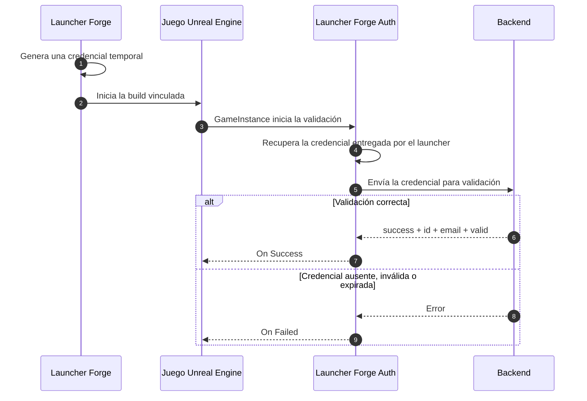

# Integración con Unreal Engine

**Launcher Forge Auth** permite que un juego desarrollado con Unreal Engine valide si fue iniciado desde una sesión autorizada de Launcher Forge.

Cuando un jugador inicia el juego desde el launcher:

1. Launcher Forge genera una credencial temporal para ese inicio.
2. El launcher inicia el ejecutable compilado y entrega la credencial automáticamente.
3. El plugin recupera internamente la credencial recibida.
4. El plugin la envía al endpoint de validación.
5. El backend devuelve `id`, `email` y `valid`.
6. El juego continúa o bloquea el acceso según el resultado.

<Warning>
  La credencial temporal no se genera ni se introduce manualmente. La validación real solo puede probarse cuando la build compilada está vinculada y es iniciada desde Launcher Forge.
</Warning>

<Card
  title="Comprender los launch tokens"
  icon="shield-halved"
  href="/es/game-authentication/launch-tokens"
>
  Revisa el flujo completo de generación, entrega y validación entre el launcher y el juego.
</Card>

<Warning>
  Esta integración valida la conexión entre el **launcher** y el **juego**. No reemplaza el registro, el inicio de sesión, la biblioteca ni el canje de CD keys de los jugadores.
</Warning>

## Flujo de validación



<Note>
  El diagrama representa un flujo automático. No es necesario ni recomendable intentar reproducir manualmente la entrega de la credencial.
</Note>

## Paquetes directos del plugin

<Info>
  Puedes encontrar el enlace de descarga a través de nuestro Discord. Abre la sección **Download plugin** y busca el canal correspondiente a **Unreal Engine**.
</Info>

<CardGroup cols={2}>
  <Card title="Unreal Engine 5.5" icon="download">
    <Badge color="green">Disponible en Discord</Badge>

    Descarga el paquete desde el canal de Unreal Engine dentro de **Download plugin**.
  </Card>

  <Card title="Unreal Engine 5.6" icon="download">
    <Badge color="green">Disponible en Discord</Badge>

    Descarga el paquete desde el canal de Unreal Engine dentro de **Download plugin**.
  </Card>

  <Card title="Unreal Engine 5.7" icon="download">
    <Badge color="green">Disponible en Discord</Badge>

    Descarga el paquete desde el canal de Unreal Engine dentro de **Download plugin**.
  </Card>

  <Card title="Unreal Engine 5.8" icon="download">
    <Badge color="green">Disponible en Discord</Badge>

    Descarga el paquete desde el canal de Unreal Engine dentro de **Download plugin**.
  </Card>
</CardGroup>

<Note>
  Utiliza siempre un paquete compatible con la versión exacta de Unreal Engine de tu proyecto.
</Note>

### Otros métodos y recursos

<CardGroup cols={2}>
  <Card title="Instalación desde Fab" icon="store">
    <Badge color="gray">No disponible por el momento</Badge>

    La distribución mediante Fab todavía no está habilitada. Utiliza el paquete disponible en Discord y realiza la instalación manual.
  </Card>

  <Card title="Proyecto de ejemplo para UE 5.5" icon="folder-open">
    <Badge color="gray">Descarga todavía no disponible</Badge>

    El documento describe `GameLauncherClient`, pero todavía no existe una URL pública de descarga.
  </Card>
</CardGroup>

---

## Instalación manual

La instalación manual coloca el plugin dentro del proyecto.

<Steps>
  <Step title="Descomprime el paquete">
    Descomprime `LauncherAuthPlugin.zip` correspondiente a tu versión de Unreal Engine.
  </Step>

  <Step title="Abre la carpeta del proyecto">
    Ve a la carpeta que contiene `YourProject.uproject`.
  </Step>

  <Step title="Crea la carpeta Plugins">
    Si todavía no existe, crea:

    ```text
    YourProject/
    └── Plugins/
    ```
  </Step>

  <Step title="Copia el plugin">
    Descomprime el plugin dentro de `Plugins`.

    La estructura esperada es:

    ```text
    YourProject/
    ├── YourProject.uproject
    └── Plugins/
        └── LauncherForgeAuth/
            ├── Binaries/
            ├── Content/
            ├── Intermediate/
            ├── Resources/
            ├── Source/
            └── LauncherForgeAuth.uplugin
    ```
  </Step>

  <Step title="Regenera los archivos del proyecto">
    Haz clic derecho sobre `YourProject.uproject` y selecciona:

    ```text
    Generate Visual Studio project files
    ```
  </Step>

  <Step title="Compila el proyecto">
    Abre `YourProject.sln` y vuelve a compilar.
  </Step>

  <Step title="Comprueba el plugin">
    Abre Unreal Engine y ve a **Edit → Plugins**. Confirma que **Launcher Forge Auth** esté activado.
  </Step>
</Steps>

<Frame caption="Estructura del plugin dentro de la carpeta Plugins">
  
</Frame>

<Frame caption="Launcher Forge Auth activado en Unreal Engine">
  
</Frame>

<Warning>
  Los binarios de un plugin C++ dependen de la versión del motor. Un paquete compilado para otra versión puede requerir recompilación.
</Warning>

---

## Configuración en GameInstance

El lugar recomendado para iniciar la validación es un Blueprint personalizado basado en `GameInstance`.

Esto permite validar temprano, antes de cargar:

- Datos del jugador.
- Menús online.
- Partidas guardadas.
- Funciones protegidas.
- Sistemas que dependan de una conexión válida con el launcher.

## 1. Crea y asigna el GameInstance

<Steps>
  <Step title="Crea el Blueprint">
    Crea una clase Blueprint basada en `GameInstance`.
  </Step>

  <Step title="Asigna un nombre">
    Por ejemplo:

    ```text
    BP_GameInstance
    ```
  </Step>

  <Step title="Abre Project Settings">
    Ve a **Edit → Project Settings → Maps & Modes**.
  </Step>

  <Step title="Selecciona la clase">
    En **Game Instance Class**, selecciona `BP_GameInstance`.
  </Step>
</Steps>

<Frame caption="BP_GameInstance asignado en Maps & Modes">
  
</Frame>

## 2. Configura Event Init

Dentro del Event Graph de `BP_GameInstance`, utiliza:

```text
Event Init → Delay 0.5 → Validate Launch Token
```

<Warning>
  Agrega un delay de **0.5 segundos** antes de ejecutar `Validate Launch Token`.

  En una build empaquetada, el subsystem o los argumentos de lanzamiento pueden no estar listos exactamente durante el primer frame de `Init`.
</Warning>

<Frame caption="Event Init, Delay 0.5 y Validate Launch Token">
  
</Frame>

---

## Nodo Validate Launch Token

El nodo principal es:

```text
Validate Launch Token
```

### Input

| Input | Descripción |
| --- | --- |
| **Backend Url** | URL completa del endpoint que valida el launch token. |

Endpoint utilizado en el documento:

```text
https://backend.launcherforge.io/api/v1/games/auth/validate-launch-token
```

### Delegates de salida

| Delegate | Comportamiento |
| --- | --- |
| **On Success** | Se ejecuta cuando el backend valida correctamente el token. |
| **On Failed** | Se ejecuta cuando el token falta, expiró, es inválido o falla la solicitud HTTP. |

<Frame caption="Nodo principal y datos autenticados">
  
</Frame>

### On Success

Utiliza `On Success` para:

- Confirmar que `Valid` sea `true`.
- Guardar o utilizar `Id` y `Email`.
- Continuar al menú principal.
- Cargar datos específicos.
- Habilitar sistemas protegidos.
- Permitir el acceso al juego.

### On Failed

Utiliza `On Failed` para:

- Mostrar un error controlado.
- Bloquear el acceso.
- Pedir que el juego sea iniciado desde Launcher Forge.
- Volver a una pantalla inicial.
- Cerrar el juego de forma controlada.

<Frame caption="Flujo Blueprint completo con éxito y error">
  
</Frame>

---

## Validación automática

Launcher Forge genera y entrega la credencial temporal como parte del inicio normal del juego.

El desarrollador no debe:

- Crear credenciales manuales para probar la integración.
- Guardarlas dentro del proyecto.
- Hardcodearlas en Blueprint o C++.
- Almacenarlas en archivos de configuración.
- Mostrarlas en la interfaz.
- Imprimirlas completas en logs de producción.

<Info>
  El plugin recibe la credencial automáticamente cuando una build vinculada es iniciada desde Launcher Forge. Abrir el juego desde el editor o ejecutar directamente el `.exe` no reproduce una validación real.
</Info>

### Solicitud interna del plugin

El plugin envía internamente la credencial al backend usando el contrato esperado por el endpoint:

```json
{
  "token": "TEMPORARY_CREDENTIAL"
}
```

No debes construir esta solicitud desde Blueprint ni pedir al jugador que introduzca un token.

## Respuesta esperada

```json
{
  "success": true,
  "data": {
    "id": "authenticated-id",
    "email": "player@example.com",
    "valid": true
  }
}
```

<ResponseField name="success" type="boolean">
  Indica que el backend procesó correctamente la validación.
</ResponseField>

<ResponseField name="data.id" type="string">
  Identificador autenticado de la cuenta o sesión.
</ResponseField>

<ResponseField name="data.email" type="string">
  Correo del usuario autenticado.
</ResponseField>

<ResponseField name="data.valid" type="boolean">
  Confirma que el backend aceptó el launch token.
</ResponseField>

El plugin expone actualmente:

```text
Id
Email
Valid
```


---

## Prueba inicial dentro del editor

Antes de compilar y vincular el juego con un launcher, puedes confirmar únicamente que el plugin y la solicitud fueron inicializados revisando el Output Log.

En este escenario es correcto observar:

- Token vacío.
- `Length: 0`.
- Una advertencia indicando que la conexión fue inicializada, pero requiere un token válido.

<Frame caption="Resultado no válido antes de iniciar desde el launcher">
  
</Frame>

<Frame caption="Output Log con token vacío dentro del editor">
  
</Frame>

Ejemplo de mensajes esperados:

```text
[LauncherForgeAuth] Launch token found. Length: 0
[LauncherForgeAuth] Request method: POST
[LauncherForgeAuth] HTTP request started.
[LauncherForgeAuth] Connection was initialized, but it requires a valid token.
```

<Info>
  Este resultado confirma únicamente que el plugin y la conexión fueron inicializados. No confirma una autenticación válida. El editor no está vinculado al launcher y no recibe la credencial temporal del flujo real.
</Info>

<Warning>
  No intentes convertir esta prueba del editor en una validación manual. La autenticación completa debe realizarse con la build publicada, vinculada e iniciada desde Launcher Forge.
</Warning>

---

## Prueba con una build vinculada

La validación completa debe probarse con:

1. El juego compilado.
2. La build publicada.
3. El juego vinculado con el launcher.
4. El ejecutable iniciado desde Launcher Forge.
5. La credencial temporal generada automáticamente durante ese inicio.

Cuando el flujo termina correctamente:

- `Valid` es `true`.
- `Email` contiene el correo autenticado.
- `Id` contiene el identificador devuelto.
- Se ejecuta `On Success`.

<Frame caption="Juego autenticado después de iniciarlo desde Launcher Forge">
  
</Frame>

<Check>
  La conexión es válida cuando Launcher Forge inicia la build vinculada, el plugin valida la credencial temporal con el backend y se ejecuta `On Success`.
</Check>

---

## Uso en C++

Los proyectos C++ pueden utilizar las clases públicas del plugin.

### Clases principales

| Clase | Responsabilidad |
| --- | --- |
| `UValidateLaunchTokenAsync` | Ejecuta la validación contra el backend. Es la clase utilizada por el nodo Blueprint. |
| `ULauncherForgeAuthSubsystem` | Recupera la credencial temporal entregada por Launcher Forge y almacena el usuario después de una validación exitosa. |
| `FLauncherForgeAuthUser` | Contiene `Id`, `Email` y `Valid`. |

## Flujo recomendado en C++

```text
GameInstance::Init()
→ Delay 0.5 segundos
→ Validate Launch Token
→ On Success: leer FLauncherForgeAuthUser
→ On Failed: manejar el error
```

<Warning>
  Mantén el delay de `0.5` segundos también en C++. Esto evita problemas de inicialización temprana en packaged builds.
</Warning>

### Ejemplo para el archivo `.cpp`

```cpp
#include "MyGameInstance.h"
#include "TimerManager.h"
#include "ValidateLaunchTokenAsync.h"
#include "LauncherForgeAuthTypes.h"

void UMyGameInstance::Init()
{
    Super::Init();

    GetWorld()->GetTimerManager().SetTimer(
        LauncherAuthTimerHandle,
        this,
        &UMyGameInstance::ValidateLauncherSession,
        0.5f,
        false
    );
}

void UMyGameInstance::ValidateLauncherSession()
{
    const FString BackendUrl =
        TEXT("https://your-api.com/api/v1/games/auth/validate-launch-token");

    UValidateLaunchTokenAsync* AuthNode =
        UValidateLaunchTokenAsync::ValidateLaunchToken(
            this,
            BackendUrl
        );

    if (!AuthNode)
    {
        UE_LOG(
            LogTemp,
            Error,
            TEXT("[LauncherForgeAuth] Failed to create validation node.")
        );
        return;
    }

    AuthNode->OnSuccess.AddDynamic(
        this,
        &UMyGameInstance::HandleLauncherAuthSuccess
    );

    AuthNode->OnFailed.AddDynamic(
        this,
        &UMyGameInstance::HandleLauncherAuthFailed
    );

    AuthNode->Activate();
}

void UMyGameInstance::HandleLauncherAuthSuccess(
    FLauncherForgeAuthUser User
)
{
    UE_LOG(
        LogTemp,
        Log,
        TEXT("[LauncherForgeAuth] Authenticated user: %s"),
        *User.Email
    );
}

void UMyGameInstance::HandleLauncherAuthFailed(
    FString ErrorMessage
)
{
    UE_LOG(
        LogTemp,
        Error,
        TEXT("[LauncherForgeAuth] Authentication failed: %s"),
        *ErrorMessage
    );
}
```

### Extracto para el archivo `.h`

```cpp
#include "LauncherForgeAuthTypes.h"

FTimerHandle LauncherAuthTimerHandle;

UFUNCTION()
void ValidateLauncherSession();

UFUNCTION()
void HandleLauncherAuthSuccess(
    FLauncherForgeAuthUser User
);

UFUNCTION()
void HandleLauncherAuthFailed(
    FString ErrorMessage
);
```

<Note>
  El código anterior reproduce el ejemplo del documento. Debes integrarlo dentro de la declaración real de tu clase `UGameInstance` y sus archivos correspondientes.
</Note>

---

## Proyecto de ejemplo GameLauncherClient

El documento describe un proyecto gratuito para **Unreal Engine 5.5** llamado `GameLauncherClient`.

El proyecto incluiría:

- El plugin incorporado.
- Un GameInstance configurado.
- El flujo de validación.
- Una base para realizar pruebas.

<Card title="GameLauncherClient para UE 5.5" icon="folder-open">
  <Badge color="gray">Descarga todavía no disponible</Badge>

  El documento no contiene una URL pública. El proyecto está preparado únicamente para UE 5.5 y requiere recompilación para versiones posteriores.
</Card>

<Note>
  Según el documento proporcionado, el plugin es gratuito y no debe comercializarse por separado.
</Note>

---

## Solución de problemas

<AccordionGroup>
  <Accordion title="El nodo no aparece">
    Confirma que el plugin esté dentro de `Plugins`, activado en **Edit → Plugins** y compilado para la versión correcta del motor.
  </Accordion>

  <Accordion title="El subsystem no está disponible">
    Ejecuta la validación desde GameInstance y conserva el delay de `0.5` segundos.
  </Accordion>

  <Accordion title="Length es 0 dentro del editor">
    Es esperado cuando el juego todavía no fue iniciado desde Launcher Forge. Comprueba que también aparezca la advertencia de conexión inicializada.
  </Accordion>

  <Accordion title="On Failed se ejecuta en la build">
    Comprueba que la build esté vinculada, que el launcher utilice el ejecutable correcto y que `Backend Url` apunte al endpoint de validación.
  </Accordion>

  <Accordion title="El backend rechaza la validación">
    Cierra el juego e inícialo nuevamente desde Launcher Forge para crear una nueva sesión temporal.

    Confirma también que:

    - La build esté vinculada al launcher.
    - El launcher utilice el ejecutable correcto.
    - `Backend Url` apunte al endpoint de validación.
    - La prueba no se esté realizando mediante el editor o ejecutando directamente el `.exe`.
  </Accordion>

  <Accordion title="El plugin fue compilado para otra versión">
    Utiliza un paquete correspondiente a tu versión del motor o recompila el plugin junto con el proyecto.
  </Accordion>
</AccordionGroup>

## Lista de verificación

- El plugin está instalado dentro de `Plugins`.
- Launcher Forge Auth está activado.
- El proyecto fue recompilado.
- `BP_GameInstance` está asignado en Maps & Modes.
- `Event Init` utiliza un delay de `0.5` segundos.
- `Validate Launch Token` utiliza la URL correcta.
- `On Success` continúa solo cuando `Valid` es `true`.
- `On Failed` bloquea el acceso de forma controlada.
- No se intenta crear, introducir o reutilizar una credencial manualmente.
- El plugin realiza internamente la solicitud de validación.
- La prueba final se realizó desde una build vinculada e iniciada por Launcher Forge.

## Guías relacionadas

<CardGroup cols={3}>
  <Card
    title="Launch tokens"
    icon="shield-halved"
    href="/es/game-authentication/launch-tokens"
  >
    Comprende el contrato completo de validación.
  </Card>

  <Card
    title="Publicar tu primera build"
    icon="cloud-arrow-up"
    href="/es/getting-started/publish-first-build"
  >
    Publica la build mediante la CLI interactiva.
  </Card>

  <Card
    title="Probar tu launcher"
    icon="flask"
    href="/es/getting-started/test-launcher"
  >
    Verifica instalación, descarga e inicio desde Launcher Forge.
  </Card>
</CardGroup>
