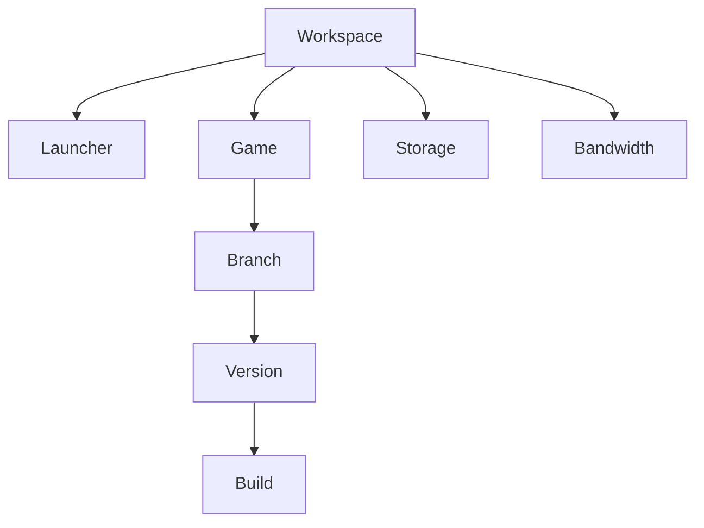

# Conceptos principales

| Concepto | Descripción |
| --- | --- |
| **Workspace** | Contenedor de launchers, juegos, miembros, facturación, uso y permisos. |
| **Launcher** | Aplicación para instalar, actualizar e iniciar juegos. |
| **Game** | Producto con información, ramas, builds y configuración de ejecución. |
| **Branch** | Canal como stable, beta, alpha, development o privado. |
| **Build** | Archivos empaquetados analizados por la CLI interactiva. |
| **Version** | Estado publicado con número, tipo y changelog. |
| **Storage** | Espacio utilizado por juegos y builds. |
| **Bandwidth** | Datos transferidos durante descargas y actualizaciones. |

<Frame caption="Relación entre workspace, launcher, juego, rama, versión y build">

</Frame>