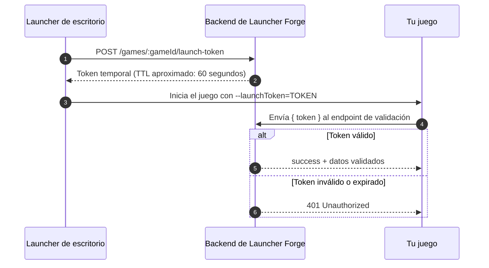

# Launch tokens

Los **launch tokens** son credenciales temporales utilizadas para validar la conexión técnica entre el **launcher** y el **juego** durante el inicio.

Su objetivo es permitir que el juego confirme que fue ejecutado mediante Launcher Forge y que el token entregado por el launcher sigue siendo válido.

<Info>
  Un launch token funciona como un pase temporal de inicio entre el launcher y el runtime del juego.
</Info>

## Qué valida un launch token

La validación conecta cuatro componentes:

- El launcher de escritorio.
- El backend de Launcher Forge.
- El ejecutable del juego.
- La integración de validación instalada en el juego.

No reemplaza:

- El registro de usuarios finales.
- El inicio de sesión dentro del launcher.
- La propiedad de un juego.
- El canje de CD keys.
- La biblioteca del jugador.

Esos procesos pertenecen a otros módulos. El launch token se utiliza específicamente para validar el inicio entre el launcher y el juego.

## Flujo general

```text
El launcher solicita un token
        ↓
El backend genera un token temporal
        ↓
El launcher inicia el juego
        ↓
El juego lee el token al arrancar
        ↓
El juego envía el token al backend
        ↓
El backend valida el token
        ↓
El juego recibe el resultado
```

## Diagrama de arquitectura



## Resumen del proceso

| Paso | Componente | Acción |
| --- | --- | --- |
| 1 | Launcher | Solicita un token para el juego seleccionado. |
| 2 | Backend | Genera y devuelve un token temporal. |
| 3 | Launcher | Inicia el ejecutable y entrega el token como argumento. |
| 4 | Juego | Lee el argumento durante el arranque. |
| 5 | Juego | Envía el token al backend para validarlo. |
| 6 | Backend | Devuelve una respuesta válida o un error `401`. |

## 1. El launcher solicita el token

Cuando el jugador selecciona **Play**, el launcher realiza una solicitud al backend para generar un token temporal asociado al juego.

### Endpoint de generación

```http
POST /games/:gameId/launch-token
```

El parámetro `:gameId` identifica el juego que será iniciado.

Ejemplo conceptual:

```http
POST /games/42/launch-token
```

El launcher debe realizar esta solicitud utilizando su sesión y contexto interno.

<Warning>
  Este endpoint forma parte del flujo interno del launcher. No debe llamarse manualmente desde el cliente del juego para intentar generar tokens.
</Warning>

## 2. El backend genera un token temporal

El backend crea un token con una duración breve.

En el flujo actual, el token tiene un TTL aproximado de:

```text
60 segundos
```

El tiempo limitado reduce la posibilidad de reutilizar un token antiguo fuera del inicio previsto.

El launcher debe iniciar el juego después de recibirlo, antes de que expire.

## 3. El launcher inicia el juego

Después de recibir el token, el launcher ejecuta el juego y lo añade a los argumentos del proceso.

Contrato de inicio:

```text
--launchToken=TOKEN
```

Ejemplo conceptual:

```text
MyGame.exe --launchToken=eyJhbGciOi...
```

<Warning>
  El token real no debe mostrarse en capturas públicas, mensajes visibles para jugadores ni logs de producción.
</Warning>

## 4. El juego lee el argumento

Durante el inicio, la integración del juego debe buscar el parámetro:

```text
--launchToken
```

El juego debe:

1. Leer los argumentos del proceso.
2. Detectar `--launchToken=...`.
3. Extraer el token.
4. Confirmar que no esté vacío.
5. Enviarlo al backend de validación.

La presencia del argumento no significa que el token sea válido. La validación real ocurre cuando el backend responde.

## 5. El juego envía el token al backend

El juego envía el token en el cuerpo de una solicitud `POST`.

### Cuerpo de la solicitud

```json
{
  "token": "LAUNCH_TOKEN"
}
```

La ruta exacta del endpoint de validación depende de la integración y de la configuración actual del backend.

El contrato esperado es:

```text
POST { token }
```

## 6. Respuesta válida

Cuando la validación termina correctamente, el backend devuelve una respuesta con el estado y los datos validados.

### Contrato de respuesta

```json
{
  "success": true,
  "data": {
    "id": "player-id",
    "email": "player@example.com",
    "valid": true
  }
}
```

### Campos disponibles

| Campo | Tipo | Descripción |
| --- | --- | --- |
| `success` | `boolean` | Indica si la solicitud fue procesada correctamente. |
| `data.id` | `string` | Identificador incluido en el resultado validado. |
| `data.email` | `string` | Correo asociado al contexto validado. |
| `data.valid` | `boolean` | Confirma si el launch token es válido. |

<Info>
  La conexión se considera validada cuando la solicitud termina correctamente y `data.valid` es `true`.
</Info>

## 7. Token inválido o expirado

Cuando el token es inválido, ya fue utilizado fuera del flujo esperado o superó su tiempo de vida, el backend responde con `401 Unauthorized`.

```json
{
  "message": "Token inválido o expirado",
  "error": "Unauthorized",
  "statusCode": 401
}
```

El juego debe tratar esta respuesta como un inicio no validado.

## Comportamiento recomendado ante un error

Cuando la validación falla, el juego debería:

- Detener el flujo que requiere una conexión validada.
- Mostrar un mensaje breve y comprensible.
- Permitir cerrar el juego o volver a una pantalla segura.
- Registrar únicamente la información técnica necesaria.
- Evitar imprimir el token completo.

Ejemplo de mensaje para el usuario:

```text
No fue posible validar el inicio del juego desde el launcher.
```

No muestres directamente:

- El token.
- Cabeceras de autorización.
- URLs privadas.
- Respuestas internas completas.
- Trazas del backend.

## Estados que debe controlar la integración

La integración debería distinguir al menos estos estados:

| Estado | Significado |
| --- | --- |
| `NotStarted` | La validación todavía no comenzó. |
| `ReadingToken` | El juego está buscando el token en los argumentos. |
| `Validating` | El token fue enviado al backend. |
| `Validated` | El backend confirmó una conexión válida. |
| `MissingToken` | El juego fue iniciado sin un launch token. |
| `ExpiredToken` | El backend rechazó el token por invalidez o expiración. |
| `NetworkError` | No fue posible contactar al backend. |
| `ValidationFailed` | La respuesta no cumple el contrato esperado. |

## Flujo lógico del juego

```text
Inicio del juego
        ↓
¿Existe --launchToken?
   ├── No → Inicio no validado
   └── Sí
        ↓
Enviar token al backend
        ↓
¿HTTP 200 y data.valid = true?
   ├── Sí → Conexión launcher-juego validada
   └── No
        ↓
¿HTTP 401?
   ├── Sí → Token inválido o expirado
   └── No → Error de red o validación
```

## Buenas prácticas de seguridad

### Trátalo como una credencial temporal

Aunque tenga una vida útil breve, el launch token debe protegerse mientras exista.

No lo guardes en:

- Archivos de configuración.
- Bases de datos locales.
- Preferencias del jugador.
- Logs de producción.
- Capturas de pantalla.
- Mensajes de error.

### No confíes solamente en el argumento

Un usuario puede iniciar manualmente un ejecutable con un argumento inventado.

El juego debe enviar el valor al backend y esperar una respuesta válida.

### No reutilices tokens

El juego no debería almacenar el launch token para utilizarlo en futuros inicios.

Cada inicio desde el launcher debe generar un nuevo token.

### Controla la expiración

El launcher debe iniciar el juego inmediatamente después de generar el token.

El juego debe comenzar la validación tan pronto como sea posible durante su inicialización.

### Maneja errores de red

Una falla de conexión no debe interpretarse como una validación correcta.

Distingue entre:

- Token inválido.
- Token expirado.
- Backend no disponible.
- Timeout.
- Respuesta inesperada.

## Integración con motores

La lógica general es la misma para todos los motores:

1. Leer `--launchToken`.
2. Extraer el token.
3. Enviar `{ token }` al backend.
4. Revisar el código HTTP.
5. Confirmar `success`.
6. Confirmar `data.valid`.
7. Continuar o rechazar el flujo.

<CardGroup cols={2}>
  <Card
    title="Unreal Engine"
    icon="gamepad"
    href="/es/engine-integrations/unreal-engine"
  >
    Configura el plugin, lee el token durante el inicio y valida la conexión desde Unreal Engine.
  </Card>

  <Card
    title="Unity"
    icon="cube"
    href="/es/engine-integrations/unity"
  >
    Configura el paquete, lee los argumentos y valida la conexión desde Unity.
  </Card>
</CardGroup>

## Lista de verificación

Antes de publicar una build destinada a distribución, comprueba:

- El juego lee `--launchToken`.
- El token se extrae sin incluir caracteres adicionales.
- La solicitud utiliza el cuerpo `{ "token": "..." }`.
- El backend responde con el contrato esperado.
- `data.valid` debe ser `true`.
- Los errores `401` se controlan correctamente.
- Los errores de red no se tratan como éxito.
- El token no aparece en logs de producción.
- El juego muestra un mensaje controlado cuando la validación falla.
- La validación se prueba iniciando el juego desde el launcher.

<Check>
  La integración está lista cuando el juego puede distinguir correctamente entre un inicio validado, un token inválido, un token ausente y un error de conexión.
</Check>

## Siguiente paso

Selecciona la integración correspondiente al motor de tu juego:

<CardGroup cols={2}>
  <Card
    title="Integrar con Unreal Engine"
    icon="gamepad"
    href="/es/engine-integrations/unreal-engine"
  >
    Implementa el flujo de launch tokens con el plugin de Launcher Forge para Unreal Engine.
  </Card>

  <Card
    title="Integrar con Unity"
    icon="cube"
    href="/es/engine-integrations/unity"
  >
    Implementa el flujo de launch tokens con el paquete de Launcher Forge para Unity.
  </Card>
</CardGroup>
